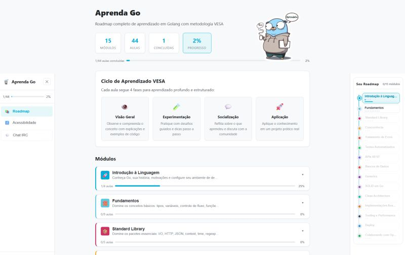

**AprendaGo** é uma plataforma web para aprender a linguagem Go do zero ao avançado, com execução de código diretamente no navegador e uma metodologia estruturada que vai além de tutoriais comuns. Ele combina conteúdo técnico progressivo com um ciclo de aprendizado ativo chamado **VESA** — sigla criada para esta plataforma que organiza cada lição em quatro fases:

| Fase | O que acontece |
|------|----------------|
| **V**isão Geral | Explicação do conceito com exemplos de código prontos para executar |
| **E**xperimentação | Desafio prático com editor de código interativo no navegador |
| **S**ocialização | Perguntas para reflexão, sugestão de post de blog e hashtags |
| **A**plicação | Projeto final com workspace multi-arquivo, `go run` e `go test` |

O aprendizado não é passivo: cada lição exige que você escreva e execute código real antes de avançar.

---

## Funcionalidades

- **Playground interativo (Experimentação)** — editor single-file com execução imediata via `/api/run`
- **Lab multi-arquivo (Aplicação)** — workspace com abas de arquivos, alternância entre `go run` e `go test`, download de arquivos individuais e suporte a TDD
- **Terminal interativo** — terminal xterm.js embarcado para módulos práticos (ferramentas, deploy, gRPC etc.), conectado via WebSocket a um container Go com projetos pré-configurados por lição
- **Roadmap visual** — sidebar com progresso por módulo e desbloqueio progressivo de lições
- **Execução segura** — código roda em sandbox Docker isolado com timeout, limite de memória e controle de concorrência
- **Progresso persistido** — estado salvo em localStorage, continue de onde parou
- **Acessibilidade** — tema claro/escuro, tamanho de fonte e espaçamento configuráveis

---

## Como rodar localmente

### Pré-requisitos

- [Docker](https://www.docker.com/) e Docker Compose
- [Make](https://www.gnu.org/software/make/) — Linux/macOS já vem instalado; no Windows instale via [Chocolatey](https://chocolatey.org/) (`choco install make`) ou [Winget](https://learn.microsoft.com/en-us/windows/package-manager/) (`winget install GnuWin32.Make`)

```bash
git clone https://github.com/scovl/AprendaGo.git
cd AprendaGo
```

### Comandos disponíveis (`make help`)

| Comando | O que faz |
|---------|-----------|
| `make up` | Sobe em produção — acesse **http://localhost:3000** |
| `make dev` | Hot reload — acesse **http://localhost:3001** |
| `make down` | Derruba os containers |
| `make test` | Roda todos os testes (Go + TypeScript) |
| `make lint` | Análise estática: `go vet` + `tsc --noEmit` |
| `make fmt` | Formata o código Go |
| `make build` | Build do frontend isolado |

O frontend é servido por nginx, e o backend Go roda em container separado com sandbox isolado (timeout 10s, 512 MB, 4 execuções simultâneas).

> **Sem Make instalado?** Rode o Docker diretamente:
> ```bash
> docker compose up -d --build                          # produção (porta 3000)
> docker compose --profile dev up                       # hot reload (porta 3001)
> docker compose --profile test run --rm runner-test   # testes Go
> docker compose down                                   # derrubar
> ```

---

## Arquitetura

```
AprendaGo/
├── src/
│   ├── data/
│   │   ├── modules/          # 14 módulos independentes (intro, fundamentos, concorrência…)
│   │   └── roadmap.ts        # Barrel que exporta todos os módulos como roadmap unificado
│   ├── components/
│   │   ├── GoCodeEditor.tsx        # Editor single-file — usado na fase Experimentação
│   │   ├── LabEditor.tsx           # Workspace multi-arquivo — usado na fase Aplicação
│   │   ├── InteractiveTerminal.tsx # Terminal xterm.js — módulos práticos sem playground
│   │   ├── VesaPhases.tsx          # Renderiza as 4 fases VESA por lição
│   │   ├── Sidebar.tsx             # Navegação e progresso por módulo
│   │   └── RoadmapTree.tsx         # Árvore de lições com desbloqueio progressivo
│   ├── context/              # Estado global: progresso e acessibilidade
│   └── types/index.ts        # Interfaces TypeScript (VesaContent, LabEditorFile…)
├── runner/
│   ├── main.go               # HTTP API: POST /run (single-file), POST /lab (multi-file)
│   └── main_test.go          # 22 testes unitários e de integração
├── terminal/
│   ├── main.go               # WebSocket↔PTY relay: conecta xterm.js a bash com Go instalado
│   ├── setup-workspace.sh    # Cria projetos pré-configurados por lição em ~/workspace/
│   ├── bashrc                # Configura PATH e cd automático para o diretório da lição
│   └── Dockerfile            # golang:1.23-alpine com ferramentas Go instaladas (golangci-lint, staticcheck…)
├── Dockerfile                # Build multi-stage do frontend (nginx)
├── runner/Dockerfile         # Build 3 estágios: testes → compilação → runtime
└── docker-compose.yml        # 5 serviços: runner, terminal, aprenda-go, dev, runner-test
```

### Endpoints do runner

| Endpoint | Método | Descrição |
|----------|--------|-----------|
| `POST /run` | — | Executa um único arquivo Go |
| `POST /lab` | — | Executa projeto multi-arquivo; suporta `mode: "run"` ou `mode: "test"` |
| `GET /health` | — | Health check |
| `GET /api/terminal/ws?lesson=<id>` | WebSocket | Abre sessão PTY com bash+Go; `lesson` define o diretório inicial |

O serviço `runner` executa código do usuário em processo isolado com:
- Timeout de 10 segundos por execução
- Limite de 512 MB de memória
- Máximo de 4 execuções simultâneas (semáforo)
- `GOPROXY=off` — sem acesso à internet do sandbox
- Diretório temporário removido após cada execução
- Nomes de arquivo validados com `filepath.Base()` — sem path traversal

---

## Diferenciais

A maioria das plataformas de aprendizado de Go oferece leitura passiva e quizzes. O AprendaGo se diferencia em três pontos:

**1. Metodologia estruturada por lição, não por capítulo**
Cada lição tem um ciclo completo — conceito → prática → reflexão → projeto. Você não lê sobre ponteiros, você escreve código com ponteiros antes de ver a próxima lição.

**2. Execução real, não simulada**
O código roda no mesmo ambiente que você usaria em produção — Go compilado de verdade, sem interpretadores JavaScript emulando a linguagem. Erros de compilação reais, output real.

**3. Lab multi-arquivo com TDD**
A fase Aplicação vai além do playground: você trabalha com um projeto real de múltiplos arquivos, pode criar `_test.go` e rodar `go test` diretamente no browser. O ciclo vermelho → verde → refatorar acontece dentro da plataforma.

**4. Roadmap com desbloqueio progressivo**
O conteúdo tem dependências explícitas. Generics ficam bloqueados até você passar por fundamentos. O roadmap visual deixa claro onde você está e o que está por vir, sem a ansiedade de um curso com centenas de vídeos desordenados.
