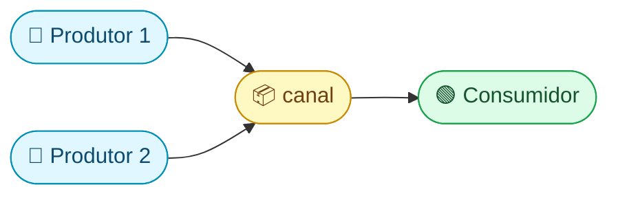

## O que é uma goroutine? — funções que rodam "ao mesmo tempo"

Imagine que você está cozinhando. Você pode:
- **Sequencial:** ferve a água, espera, cozinha o macarrão, espera, faz o molho → lento
- **Concorrente:** coloca a água pra ferver, **enquanto isso** faz o molho → rápido

Em Go, uma **goroutine** é uma tarefa que roda "ao mesmo tempo" que outras. Você cria uma com a palavra `go`:

```go
func dizerOi(nome string) {
    fmt.Println("Oi,", nome)
}

func main() {
    go dizerOi("Ana")     // lança goroutine — roda em "paralelo"
    go dizerOi("Bruno")   // outra goroutine
    dizerOi("Carlos")     // roda na goroutine principal (main)
    time.Sleep(time.Second) // espera as goroutines terminarem
}
```

Saída (a ordem pode variar!):
```
Oi, Carlos
Oi, Ana
Oi, Bruno
```

### Por que a ordem muda?

Goroutines são **concorrentes** — o runtime Go decide quem roda quando. Não tem garantia de ordem. Cada execução pode dar resultado diferente.

### Goroutines são absurdamente baratas

| | Thread OS (Java, C#) | Goroutine (Go) |
|---|---|---|
| Memória inicial | ~1MB de stack | **~2KB** de stack |
| Criar 10.000 | Trava o sistema | Tranquilo |
| Criar 100.000 | Impossível | **Ainda tranquilo** |
| Quem gerencia | Kernel do SO | Runtime do Go |
| Troca de contexto | Cara (kernel) | Barata (userspace) |

> **Analogia:** threads OS são como **caminhões** — pesados, caros, limitados. Goroutines são como **bicicletas** — leves, baratas, cabem milhares na mesma rua.

O runtime do Go usa um modelo chamado **M:N**: ele multiplexa **M** goroutines em **N** threads do sistema operacional (`GOMAXPROCS` = número de CPUs). O scheduler do Go faz toda a mágica.

---

## O problema: como goroutines se comunicam?

Goroutines rodam de forma independente. Como uma passa dados para a outra? Com **channels** (canais).

> **Frase famosa:** "Não comunique compartilhando memória; compartilhe memória comunicando." — Provérbio Go

### O que é um channel?

Um channel é um **tubo** que conecta goroutines. Uma goroutine coloca dados de um lado, outra goroutine pega do outro lado.


### Criando e usando channels

```go
ch := make(chan string)  // cria um canal de strings

// Goroutine que ENVIA
go func() {
    ch <- "Olá!"    // coloca "Olá!" no canal (← seta aponta PRO canal)
}()

// Main RECEBE
msg := <-ch          // pega do canal (← seta aponta PRA FORA do canal)
fmt.Println(msg)     // "Olá!"
```

### A direção da seta `<-` conta a história

| Código | Leia como | O que faz |
|---|---|---|
| `ch <- valor` | "valor **vai para** o canal" | **Envia** para o canal |
| `valor := <-ch` | "valor **vem do** canal" | **Recebe** do canal |
| `chan<- int` | "canal que só recebe" | Tipo **send-only** |
| `<-chan int` | "canal que só envia" | Tipo **receive-only** |

---

## Unbuffered vs Buffered — com ou sem espaço interno

### Unbuffered (sem buffer) — entrega na mão

```go
ch := make(chan int)  // sem buffer — capacidade 0
```

O envio **bloqueia** até alguém receber. O recebimento **bloqueia** até alguém enviar. É como uma **ligação telefônica**: os dois precisam estar na linha ao mesmo tempo.

```go
ch := make(chan int)

go func() {
    ch <- 42           // BLOQUEIA aqui até main receber
    fmt.Println("Enviado!")
}()

valor := <-ch          // BLOQUEIA aqui até a goroutine enviar
fmt.Println(valor)     // 42
```

### Buffered (com buffer) — caixa de correio

```go
ch := make(chan int, 3)  // buffer de 3 — cabe 3 valores sem bloquear
```

O envio só bloqueia quando o buffer está **cheio**. O recebimento só bloqueia quando está **vazio**. É como uma **caixa de correio**: o carteiro põe a carta sem esperar, mas se a caixa tiver cheia, ele espera.

```go
ch := make(chan int, 2)
ch <- 10    // buffer: [10]     — não bloqueia
ch <- 20    // buffer: [10, 20] — não bloqueia
// ch <- 30  // BLOQUEARIA! buffer cheio — precisaria alguém receber

fmt.Println(<-ch)  // 10 — buffer: [20]
fmt.Println(<-ch)  // 20 — buffer: []
```

### Quando usar cada um?

| Tipo | Quando usar |
|---|---|
| **Unbuffered** `make(chan T)` | Sincronização — quer garantir que o receptor pegou o valor |
| **Buffered** `make(chan T, N)` | Desacoplar velocidade — produtor e consumidor em ritmos diferentes |

---

## Fechando channels — "não tenho mais nada pra enviar"

Fechar um canal sinaliza: **acabou, não vai ter mais dados**. Quem está recebendo precisa saber quando parar.

```go
ch := make(chan int)

go func() {
    for i := 1; i <= 3; i++ {
        ch <- i
    }
    close(ch)  // "terminei de enviar"
}()

// for range lê até o canal fechar
for valor := range ch {
    fmt.Println(valor)  // 1, 2, 3 — depois para automaticamente
}
```

### As regras de close — decore esta tabela!

| Operação | Canal `nil` | Canal aberto | Canal **fechado** |
|---|---|---|---|
| **Enviar** `ch <- v` | Bloqueia pra sempre | Envia (bloqueia se cheio) | **PANIC!** 💥 |
| **Receber** `<-ch` | Bloqueia pra sempre | Recebe (bloqueia se vazio) | Retorna zero value |
| **Fechar** `close(ch)` | **PANIC!** 💥 | Fecha normalmente | **PANIC!** 💥 |

> **3 panics para memorizar:** enviar em canal fechado, fechar canal nil, fechar canal já fechado. Os três causam panic.

### Como saber se o canal fechou?

```go
valor, ok := <-ch
if ok {
    fmt.Println("Recebi:", valor)
} else {
    fmt.Println("Canal fechou!")  // ok == false
}
```

O `ok` é `false` quando o canal está fechado E não tem mais valores no buffer.

> **Regra prática:** quem **envia** fecha o canal. Quem **recebe** nunca fecha — só para de ler quando `range` termina ou `ok == false`.

---

## `select` — esperando vários canais ao mesmo tempo

E se você tem **dois canais** e quer receber do que chegar primeiro? Use `select`:

```go
select {
case msg := <-emailCh:
    fmt.Println("Email:", msg)
case msg := <-smsCh:
    fmt.Println("SMS:", msg)
case <-time.After(3 * time.Second):
    fmt.Println("Timeout! Ninguém respondeu em 3s")
}
```

### Como o `select` funciona, passo a passo:

1. Olha todos os `case` ao mesmo tempo
2. Se **um** está pronto → executa esse
3. Se **vários** estão prontos → escolhe um **aleatório** (evita favorecer sempre o mesmo)
4. Se **nenhum** está pronto → bloqueia até um ficar pronto
5. Se tem `default` → executa o `default` em vez de bloquear

### `select` com `default` — operação não-bloqueante

```go
select {
case msg := <-ch:
    fmt.Println("Recebi:", msg)
default:
    fmt.Println("Nada disponível agora — sigo em frente")
}
```

Isso é um **try-receive**: tenta receber, mas se não tem nada, não espera.

---

## Padrão produtor/consumidor — o mais importante

Este é o padrão mais comum com goroutines e channels:



```go
func produtor(ch chan<- int, id int) {
    for i := 0; i < 3; i++ {
        valor := id*100 + i
        ch <- valor
        fmt.Printf("Produtor %d enviou %d\n", id, valor)
    }
}

func consumidor(ch <-chan int) {
    for valor := range ch {
        fmt.Printf("  Consumidor recebeu: %d\n", valor)
    }
}

func main() {
    ch := make(chan int, 5)

    // 2 produtores enviando
    go produtor(ch, 1)
    go produtor(ch, 2)

    // Espera produtores e fecha o canal
    time.Sleep(time.Second)
    close(ch)

    // Consumidor lê até o canal fechar
    consumidor(ch)
}
```

Note os tipos direcionais: `chan<- int` (só envia) e `<-chan int` (só recebe). O compilador **impede** que o produtor tente receber ou que o consumidor tente enviar.

---

## Goroutine leak — o bug silencioso mais perigoso

Uma goroutine que nunca termina é um **vazamento**. Ela fica consumindo memória para sempre:

```go
// ❌ LEAK! Se ninguém ler de ch, a goroutine fica presa no envio para sempre
go func() {
    ch <- resultado  // bloqueia eternamente se ninguém recebe
}()
```

### Como evitar:

1. **Sempre feche channels** quando não vai mais enviar
2. **Use `context.WithCancel`** para sinalizar goroutines que devem parar
3. **Use `select` com canal de done** para dar uma saída de emergência:

```go
done := make(chan struct{})

go func() {
    select {
    case ch <- resultado:
        // enviou com sucesso
    case <-done:
        // alguém mandou parar — saio limpo
        return
    }
}()

// Quando quiser cancelar:
close(done)
```

---

## Resumo visual

```
go funcao()          → lança goroutine (2KB, baratíssima)
ch := make(chan T)   → canal unbuffered (entrega na mão)
ch := make(chan T,N) → canal buffered (caixa de correio com N espaços)
ch <- valor          → envia (← aponta pro canal)
valor := <-ch        → recebe (← aponta pra fora)
close(ch)            → "acabou" (quem envia fecha)
for v := range ch    → lê até fechar
select { case... }   → espera vários canais
```
