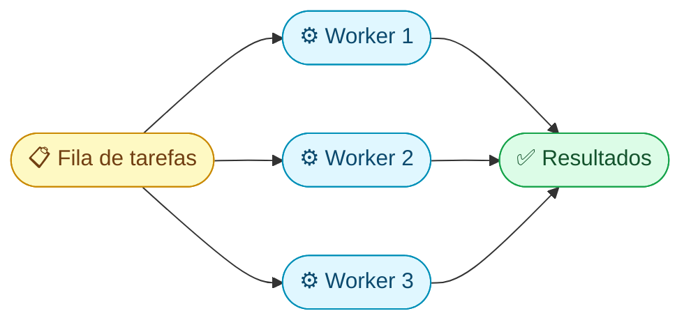
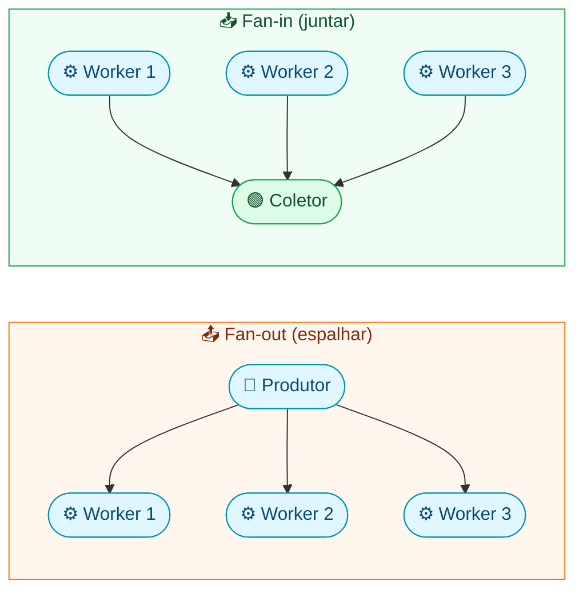
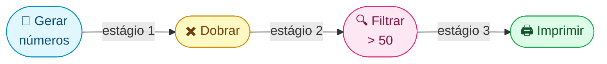

## O problema: como controlar a bagunça de goroutines?

> **Pré-requisitos desta lição:** goroutines e channels (lição 1) e `sync.WaitGroup` / `sync.Mutex` (lição 2). Os exemplos também usam o pacote `context` — se ainda não passou pelo módulo Standard Library, o essencial é: `context.WithTimeout(ctx, dur)` cria um contexto que cancela após o tempo dado, e `ctx.Done()` é um channel que é fechado quando isso acontece.

Na lição anterior, você aprendeu a criar goroutines e channels. Mas na vida real, surgem perguntas:

- "Preciso baixar 1000 URLs, mas não posso abrir 1000 conexões de uma vez"
- "Tenho 3 estágios de processamento — como conectar um no outro?"
- "O usuário apertou Ctrl+C — como paro tudo de forma limpa?"

Os **padrões de concorrência** são receitas prontas para esses problemas. Vamos ver os 4 mais importantes.

---

## Padrão 1: Worker Pool — "balcão de atendimento"

### O problema

Você tem 10.000 tarefas para executar, mas rodar 10.000 goroutines simultâneas vai sobrecarregar o sistema (memória, conexões de rede, CPU).

### A solução

Crie um número fixo de goroutines (workers) que **pegam tarefas de uma fila** compartilhada:



> **Analogia:** pense num **banco** com 3 caixas (workers). Tem 50 pessoas na fila (jobs). Cada caixa atende uma pessoa de cada vez. Quando termina, chama a próxima. Não precisa de 50 caixas — 3 dão conta, só demora mais.

### Código passo a passo

```go
func worker(id int, jobs <-chan int, results chan<- string, wg *sync.WaitGroup) {
    defer wg.Done()
    for job := range jobs {  // pega o próximo job da fila (range para quando fechar)
        // simula trabalho
        time.Sleep(100 * time.Millisecond)
        results <- fmt.Sprintf("Worker %d fez job %d", id, job)
    }
}

func main() {
    jobs := make(chan int, 10)       // fila de tarefas
    results := make(chan string, 10) // fila de resultados

    // Abre 3 "caixas" (workers)
    var wg sync.WaitGroup
    for i := 1; i <= 3; i++ {
        wg.Add(1)
        go worker(i, jobs, results, &wg)
    }

    // Coloca 10 tarefas na fila
    for j := 1; j <= 10; j++ {
        jobs <- j
    }
    close(jobs)  // "acabou a fila" — workers terminam quando esvaziar

    // Fecha resultados quando todos os workers terminarem
    go func() {
        wg.Wait()
        close(results)
    }()

    // Lê todos os resultados
    for r := range results {
        fmt.Println(r)
    }
}
```

### Como funciona, passo a passo:

1. Cria os channels `jobs` (entrada) e `results` (saída)
2. Lança 3 workers — cada um faz `for job := range jobs` (fica esperando trabalho)
3. Envia 10 jobs pelo channel `jobs`
4. `close(jobs)` — sinaliza "não tem mais trabalho". O `range` dos workers termina
5. Quando todos os workers terminam (`wg.Wait()`), fecha `results`
6. O `for r := range results` no main lê tudo e termina

### Quantos workers usar?

| Tipo de trabalho | Exemplo | Quantos workers? |
|---|---|---|
| **CPU-bound** (cálculo pesado) | Criptografia, compressão | `runtime.NumCPU()` (número de CPUs) |
| **I/O-bound** (espera rede/disco) | HTTP requests, queries SQL | 10x a 100x mais que CPUs |

> **Por quê?** Trabalho CPU-bound usa 100% do processador — mais workers que CPUs não ajuda. Trabalho I/O-bound **espera** a maior parte do tempo — enquanto um worker espera a rede, outro trabalha.

---

## Padrão 2: Fan-out / Fan-in — "distribuir e coletar"

Esses dois padrões sempre andam juntos:

- **Fan-out** = 1 produtor distribui trabalho para N workers (espalhar)
- **Fan-in** = N workers enviam resultados para 1 channel (juntar)



O Worker Pool que vimos acima já **usa os dois**: jobs faz fan-out (1 channel → N workers) e results faz fan-in (N workers → 1 channel).

### O truque do fan-in: quando fechar o channel de resultados?

Esse é o ponto que mais confunde iniciantes. Você não pode fechar `results` até **todos** os workers terem terminado. A solução:

```go
// Goroutine separada que espera todos os workers e fecha results
go func() {
    wg.Wait()       // espera todos os workers
    close(results)  // agora sim — ninguém mais vai escrever
}()
```

> **Erro comum:** fechar `results` dentro de um worker → panic, porque os outros workers ainda estão escrevendo. **Quem fecha** é quem sabe que **todos** os produtores terminaram.

---

## Padrão 3: Pipeline — "linha de montagem"

Um pipeline conecta estágios em sequência, cada um fazendo uma transformação:



Cada estágio é uma goroutine que lê de um channel e escreve em outro:

```go
// Estágio 1: gera números
func gerar(nums ...int) <-chan int {
    out := make(chan int)
    go func() {
        defer close(out)
        for _, n := range nums {
            out <- n
        }
    }()
    return out  // retorna o channel de saída
}

// Estágio 2: dobra cada número
func dobrar(in <-chan int) <-chan int {
    out := make(chan int)
    go func() {
        defer close(out)
        for n := range in {
            out <- n * 2
        }
    }()
    return out
}

// Estágio 3: filtra (mantém só >= 50)
func filtrar(in <-chan int, min int) <-chan int {
    out := make(chan int)
    go func() {
        defer close(out)
        for n := range in {
            if n >= min {
                out <- n
            }
        }
    }()
    return out
}

func main() {
    // Conecta os estágios como uma corrente:
    numeros := gerar(10, 20, 30, 40, 50)  // gera
    dobrados := dobrar(numeros)             // 20, 40, 60, 80, 100
    grandes := filtrar(dobrados, 50)        // 60, 80, 100

    for v := range grandes {
        fmt.Println(v)  // 60, 80, 100
    }
}
```

### Por que pipeline é poderoso?

Cada estágio roda em sua **própria goroutine**. Enquanto o estágio 3 processa o número 60, o estágio 2 já está dobrando o próximo, e o estágio 1 já está gerando outro. É como uma **linha de montagem de fábrica** — todos os estágios trabalham ao mesmo tempo.

### Cancelando um pipeline no meio

Se o consumidor não precisa mais de resultados (ex: encontrou o que precisava), as goroutines dos estágios anteriores ficariam presas para sempre (goroutine leak!). Use `context` para cancelar:

```go
ctx, cancel := context.WithCancel(context.Background())
defer cancel()  // quando main terminar, cancela tudo

// Dentro de cada estágio:
select {
case <-ctx.Done():
    return           // contexto cancelado — para limpo
case out <- valor:
    // enviou com sucesso
}
```

---

## Padrão 4: Semáforo — "controlador de lotação"

Às vezes você não precisa de um worker pool completo — só quer **limitar quantas goroutines rodam ao mesmo tempo**.

> **Analogia:** um estacionamento com 5 vagas. Carros entram e saem, mas nunca mais de 5 ao mesmo tempo. Quando está lotado, o próximo carro espera.

### Como funciona: channel buffered como semáforo

```go
// "Estacionamento" com 3 vagas
sem := make(chan struct{}, 3)

for i := 0; i < 100; i++ {
    sem <- struct{}{}  // "entra no estacionamento" (bloqueia se cheio)
    go func(id int) {
        defer func() { <-sem }()  // "sai do estacionamento" ao terminar
        
        // trabalho pesado aqui...
        fmt.Printf("Goroutine %d trabalhando\n", id)
        time.Sleep(time.Second)
    }(i)
}
```

No máximo 3 goroutines rodam ao mesmo tempo. A 4ª fica esperando em `sem <- struct{}{}` até uma terminar e liberar a vaga com `<-sem`.

### Worker Pool vs Semáforo — quando usar cada um?

| | Worker Pool | Semáforo |
|---|---|---|
| Goroutines | N fixas, reutilizadas | Novas para cada tarefa |
| Quando usar | Tarefas homogêneas (mesma função) | Tarefas diversas, só quer limitar |
| Complexidade | Maior (jobs channel, WaitGroup) | Menor (só o channel buffered) |
| Exemplo | "3 downloaders processando uma fila" | "No máximo 10 goroutines ao mesmo tempo" |

---

## Graceful Shutdown — "fechando o restaurante educadamente"

Quando o usuário aperta **Ctrl+C**, você não quer cortar tudo no meio. Quer:
1. Parar de aceitar trabalho novo
2. Terminar o trabalho em andamento
3. Fechar tudo de forma limpa

> `os.Interrupt` é o **sinal SIGINT** — o sinal que o sistema operacional envia quando Ctrl+C é apertado. `signal.NotifyContext` converte esse sinal de SO em cancelamento de context, integrando o mecanismo de shutdown do OS com o sistema de cancelamento do Go.

```go
func main() {
    // Captura Ctrl+C e transforma em cancelamento de context
    ctx, stop := signal.NotifyContext(context.Background(), os.Interrupt)
    defer stop()

    jobs := make(chan Job)
    // ... lança workers com ctx ...

    // Quando Ctrl+C for apertado, ctx.Done() é fechado
    // Workers verificam ctx.Done() e terminam limpo
    <-ctx.Done()
    fmt.Println("Encerrando... aguardando workers terminarem")
    // wg.Wait() aqui para esperar todos finalizarem
}
```

### O fluxo:

1. `signal.NotifyContext` — transforma o sinal Ctrl+C em cancelamento de `context`
2. Quando Ctrl+C chega → `ctx.Done()` é fechado
3. Cada worker verifica `<-ctx.Done()` no `select` → para de pegar jobs e termina
4. `wg.Wait()` espera todos os workers terminarem
5. Programa sai limpo, sem goroutine leaks

---

## Goroutine leaks — o checklist de prevenção

Goroutine leak = goroutine presa para sempre, consumindo memória. Como evitar:

| Causa | Como prevenir |
|---|---|
| Channel sem leitor | Sempre garanta um consumer para cada channel |
| Channel sem escritor (e reader bloqueado) | Use `select` com `ctx.Done()` como saída de emergência |
| Operação de rede sem timeout | Use `context.WithTimeout` |
| Esqueceu de fechar channel | `defer close(ch)` no produtor |
| Loop infinito sem condição de parada | Verifique `ctx.Done()` a cada iteração |

```go
// ❌ Leak: se ninguém lê de ch, goroutine fica presa para sempre
go func() {
    ch <- resultado
}()

// ✅ Seguro: context dá uma saída de emergência
go func() {
    select {
    case ch <- resultado:
        // enviou
    case <-ctx.Done():
        // cancelaram — saio limpo
    }
}()
```

---

## Resumo dos padrões

| Padrão | Problema que resolve | Analogia |
|---|---|---|
| **Worker Pool** | Limitar concorrência com reuso | Caixas de banco |
| **Fan-out/Fan-in** | Distribuir e coletar | Espalhar e juntar |
| **Pipeline** | Processamento em estágios | Linha de montagem |
| **Semáforo** | Limitar concorrência simples | Estacionamento com vagas |
| **Graceful Shutdown** | Parar tudo de forma limpa | Fechar o restaurante |
