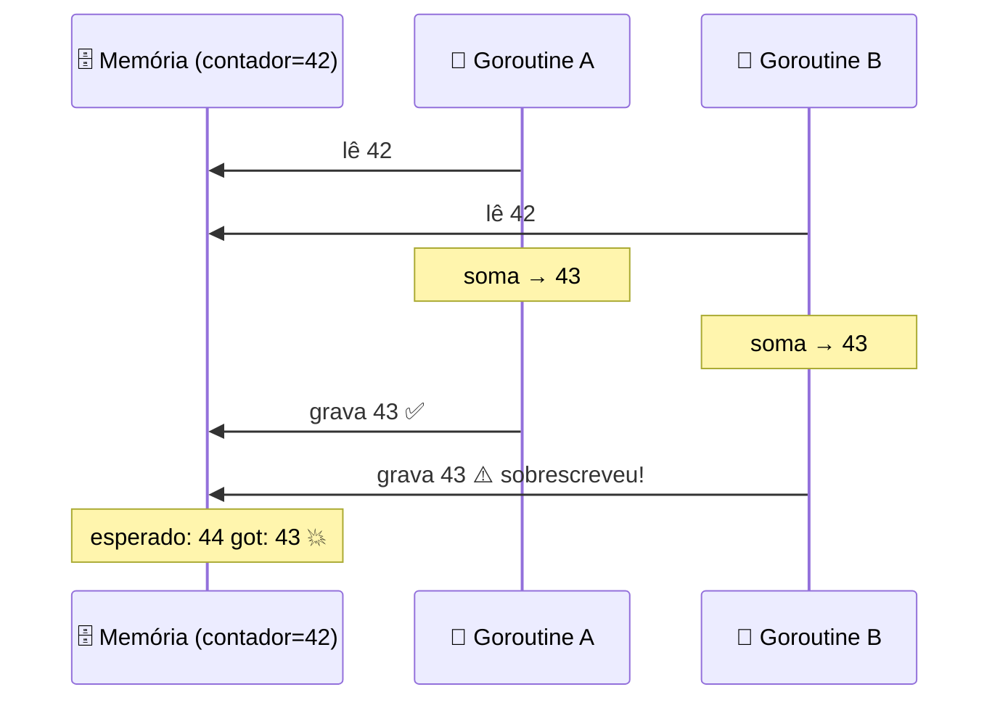

## O problema: goroutines brigando pelo mesmo dado

Quando duas goroutines leem e escrevem na **mesma variável** ao mesmo tempo, o resultado é imprevisível. Isso se chama **data race** (corrida de dados):

```go
var contador int

// 1000 goroutines incrementando ao mesmo tempo
for i := 0; i < 1000; i++ {
    go func() {
        contador++  // ❌ DATA RACE!
    }()
}
time.Sleep(time.Second)
fmt.Println(contador)  // Esperava 1000, mas pode ser 947, 983, 1000...
```

### Por que `contador++` dá errado?

Parece uma operação só, mas na verdade são **três**:

```
1. Lê o valor atual   (ex: 42)
2. Soma 1             (42 + 1 = 43)
3. Grava o novo valor (43)
```

Se duas goroutines fazem isso ao mesmo tempo:



Resultado: duas goroutines incrementaram, mas o valor só subiu 1. Perdemos um incremento!

> **Analogia:** duas pessoas editando o mesmo documento do Word ao mesmo tempo, sem Google Docs — uma salva por cima da outra.

### Como detectar: a flag `-race`

Go tem um detector de data race embutido:

```bash
go run -race main.go
```

Se tiver data race, ele mostra **exatamente** onde está:

```
WARNING: DATA RACE
Write at 0x00c0000b4010 by goroutine 7:
  main.main.func1()
      /main.go:10 +0x38
```

> **Regra de ouro:** sempre rode `go test -race` nos testes. Coloque no CI. Não negocie isso.

---

## `sync.WaitGroup` — "esperando todo mundo terminar"

O WaitGroup resolve: "lancei N goroutines, como espero todas terminarem?"

> **Analogia:** você é o professor numa excursão. Conta os alunos antes de entrar no ônibus: "faltam 3... faltam 2... faltam 1... todos prontos, vamos!"

### As 3 operações

| Operação | O que faz | Analogia |
|---|---|---|
| `wg.Add(n)` | "Vão sair N alunos" | Conta quantos faltam |
| `wg.Done()` | "Cheguei!" (decrementa 1) | Um aluno voltou |
| `wg.Wait()` | "Espero até todos chegarem" | Professor no ônibus |

### Exemplo completo

```go
var wg sync.WaitGroup

for i := 1; i <= 3; i++ {
    wg.Add(1)  // "mais um vai sair" — ANTES de lançar a goroutine!
    go func(id int) {
        defer wg.Done()  // "cheguei!" — roda quando a goroutine termina
        fmt.Printf("Worker %d trabalhando...\n", id)
        time.Sleep(time.Second)
        fmt.Printf("Worker %d terminou\n", id)
    }(i)
}

wg.Wait()  // bloqueia aqui até todos chamarem Done()
fmt.Println("Todos terminaram!")
```

### A armadilha do `Add` — decorar!

```go
// ❌ ERRADO: Add dentro da goroutine
go func() {
    wg.Add(1)  // pode rodar DEPOIS do Wait!
    defer wg.Done()
    // ...
}()
wg.Wait()  // pode terminar antes do Add → não espera ninguém

// ✅ CERTO: Add ANTES de lançar a goroutine
wg.Add(1)
go func() {
    defer wg.Done()
    // ...
}()
wg.Wait()
```

---

## `sync.Mutex` — "tranca no banheiro"

Mutex (mutual exclusion) é uma **tranca**: só uma goroutine por vez pode entrar na seção crítica.

> **Analogia:** banheiro com tranca. Alguém entra, tranca (`Lock`), usa, destranca (`Unlock`). Quem chega e está trancado, **espera na fila**.

### Corrigindo o data race com Mutex

```go
var (
    mu       sync.Mutex
    contador int
)

for i := 0; i < 1000; i++ {
    go func() {
        mu.Lock()         // 🔒 tranca — só eu entro agora
        contador++         // seção crítica — seguro!
        mu.Unlock()       // 🔓 destranca — próximo pode entrar
    }()
}

// ... wg.Wait() ...
fmt.Println(contador)  // sempre 1000 ✅
```

### O padrão obrigatório: `defer mu.Unlock()`

```go
mu.Lock()
defer mu.Unlock()  // SEMPRE use defer — garante desbloqueio mesmo se der panic

// seção crítica aqui...
```

> **Por que defer?** Se o código dentro da seção crítica der panic e você não usou defer, a tranca fica trancada **para sempre** — todas as outras goroutines ficam esperando eternamente (**deadlock**).

### Exemplo prático: cache thread-safe

```go
type Cache struct {
    mu    sync.Mutex
    dados map[string]string
}

func (c *Cache) Get(chave string) (string, bool) {
    c.mu.Lock()
    defer c.mu.Unlock()
    val, ok := c.dados[chave]
    return val, ok
}

func (c *Cache) Set(chave, valor string) {
    c.mu.Lock()
    defer c.mu.Unlock()
    c.dados[chave] = valor
}
```

---

## `sync.RWMutex` — "leitura livre, escrita exclusiva"

Se 90% das operações são leitura, `Mutex` é desperdício — por que bloquear leitores entre si? `RWMutex` permite:

- **Vários leitores ao mesmo tempo** (`RLock`/`RUnlock`)
- **Apenas um escritor por vez** (e nenhum leitor durante a escrita) (`Lock`/`Unlock`)

```go
var rwmu sync.RWMutex

// Leitura — vários podem ler ao mesmo tempo
func ler() string {
    rwmu.RLock()          // 📖 trava para leitura (permite outros leitores)
    defer rwmu.RUnlock()
    return dados["chave"]
}

// Escrita — exclusiva, ninguém mais acessa
func escrever(valor string) {
    rwmu.Lock()           // 🔒 trava para escrita (bloqueia TUDO)
    defer rwmu.Unlock()
    dados["chave"] = valor
}
```

### Quando usar Mutex vs RWMutex?

| Cenário | Use |
|---|---|
| Mais escritas que leituras | `sync.Mutex` (mais simples) |
| Muito mais leituras que escritas | `sync.RWMutex` (leitores não se bloqueiam) |
| Não sabe? | `sync.Mutex` (comece simples) |

---

## `sync/atomic` — "operações instantâneas sem tranca"

Para operações simples (incrementar um contador, trocar um valor), atomic é mais rápido que Mutex porque usa instruções especiais do **processador** — sem tranca, sem fila:

```go
var contador int64

for i := 0; i < 1000; i++ {
    go func() {
        atomic.AddInt64(&contador, 1)  // incremento atômico — seguro sem Mutex!
    }()
}

// ... wg.Wait() ...
fmt.Println(contador)  // sempre 1000 ✅
```

### Mutex vs Atomic — quando usar cada um?

| | `sync.Mutex` | `sync/atomic` |
|---|---|---|
| Para que serve | Proteger **qualquer** código | Operações simples em **um valor** |
| Performance | Boa | Melhor (sem lock) |
| Complexidade | Pode proteger 10 linhas de código | Só uma operação por vez |
| Exemplo | Atualizar struct, map, múltiplas variáveis | Incrementar contador, trocar flag |

> **Regra prática:** se é um contador ou flag simples → `atomic`. Se são várias operações juntas que precisam ser atômicas → `Mutex`.

### Desde Go 1.19: tipos atômicos com métodos

```go
var contador atomic.Int64   // tipo novo — mais ergonômico

contador.Add(1)             // em vez de atomic.AddInt64(&contador, 1)
fmt.Println(contador.Load()) // em vez de atomic.LoadInt64(&contador)
```

---

## `sync.Once` — "executa uma vez e nunca mais"

Garante que uma função rode **exatamente uma vez**, não importa quantas goroutines tentem:

```go
var once sync.Once
var db *Database

func getDB() *Database {
    once.Do(func() {
        fmt.Println("Conectando ao banco...")  // imprime UMA vez
        db = conectarBanco()
    })
    return db  // nas próximas chamadas, retorna o db já criado
}
```

Mesmo que 100 goroutines chamem `getDB()` ao mesmo tempo, `conectarBanco()` roda **uma única vez**. As outras goroutines esperam até terminar e recebem o resultado pronto.

> **Quando usar:** inicialização lazy — coisas que são caras de criar e só precisam ser feitas uma vez (conexão com banco, carregar config, compilar regex).

---

## `sync.Map` — map thread-safe (use com cautela)

Go tem um map thread-safe pronto, mas com uma pegadinha:

```go
var m sync.Map

m.Store("chave", "valor")          // equivale a map[chave] = valor
val, ok := m.Load("chave")         // equivale a val, ok := map[chave]
m.Delete("chave")                  // equivale a delete(map, chave)
```

### Quando usar `sync.Map` vs `map + Mutex`?

| | `map + Mutex` | `sync.Map` |
|---|---|---|
| Performance geral | Melhor na maioria dos casos | Melhor em casos específicos |
| Casos específicos | — | Muita leitura, pouca escrita, chaves estáveis |
| Simplicidade | Mais previsível | API diferente (Store/Load em vez de `[]`) |
| Type safety | Sim (tipos definidos no map) | Não (`any` — precisa cast) |

> **Na dúvida, use `map + Mutex`.** `sync.Map` é otimizado para cenários muito específicos. A maioria dos programas Go usa `map` com `Mutex` e funciona bem.

---

## Channels vs Locks — quando usar cada um?

Essa é a dúvida mais comum de quem está aprendendo concorrência em Go:

| Use **Channels** quando... | Use **Mutex/Atomic** quando... |
|---|---|
| Goroutines precisam **comunicar** | Goroutines precisam **proteger dados** |
| Passando dados de A para B | Várias goroutines acessando mesma variável |
| Coordenando pipeline/worker pool | Cache, mapa compartilhado, contador |
| Sinalização (done, cancel) | Seção crítica curta |

> **Provérbio Go:** "Não comunique compartilhando memória; compartilhe memória comunicando." Na prática: prefira channels para coordenação, e mutex para proteção de estado.

---

## Resumo — qual ferramenta usar?

| Preciso de... | Use |
|---|---|
| Esperar N goroutines terminarem | `sync.WaitGroup` |
| Proteger acesso a dados compartilhados | `sync.Mutex` |
| Muitas leituras, poucas escritas | `sync.RWMutex` |
| Incrementar/trocar valor simples | `sync/atomic` |
| Inicializar algo uma vez (lazy) | `sync.Once` |
| Map thread-safe (caso específico) | `sync.Map` |
| Detectar data races | `go run -race` / `go test -race` |
