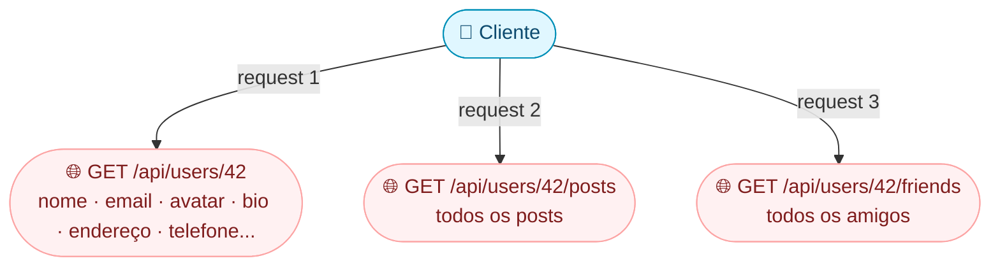

## O problema que GraphQL resolve

Imagine que você tem uma API REST de rede social. Para mostrar o perfil de um usuário, você precisa:



**Três requests**, e na tela do celular você só precisava do nome, avatar e os 3 últimos posts. O REST te deu **dados demais** (over-fetching) e exigiu **requests demais** (under-fetching).

### GraphQL: o cliente pede exatamente o que quer

Com GraphQL, **uma request** resolve:

```graphql
query {
  user(id: "42") {
    name
    avatar
    posts(limit: 3) {
      title
      createdAt
    }
  }
}
```

Resposta — só o que pediu, nada a mais:

```json
{
  "data": {
    "user": {
      "name": "Ana",
      "avatar": "https://...",
      "posts": [
        { "title": "Aprendendo Go", "createdAt": "2024-01-15" },
        { "title": "Generics são legais", "createdAt": "2024-01-10" },
        { "title": "Meu primeiro CLI", "createdAt": "2024-01-05" }
      ]
    }
  }
}
```

> **Analogia:** REST é como um **cardápio fixo** no restaurante — o prato vem pronto, com tudo incluído, mesmo que você não goste de salada. GraphQL é como um **buffet** — você monta seu prato com exatamente o que quer.

---

## REST vs GraphQL — comparação honesta

| Aspecto | REST | GraphQL |
|---|---|---|
| Quem decide os dados? | **Servidor** (endpoint fixo) | **Cliente** (query personalizada) |
| Quantos endpoints? | Vários (`/users`, `/posts`, `/comments`) | **Um só** (`/graphql`) |
| Over-fetching | Comum (dados extra vêm junto) | Eliminado (só vem o que pediu) |
| Under-fetching | Comum (precisa de múltiplos requests) | Eliminado (uma query busca tudo) |
| Cache HTTP | Nativo (GET cacheavel) | Mais complexo |
| Aprender | Simples | Mais conceitos novos |
| Melhor para | APIs públicas, CRUD simples | Apps com dados complexos e variados |

> **Quando usar GraphQL?** Quando diferentes clientes (web, mobile, TV) precisam de **subconjuntos diferentes** dos mesmos dados. Se todo mundo precisa dos mesmos campos, REST é mais simples.

---

## GraphQL em Go com gqlgen — schema-first

Em Go, o framework mais popular é o **gqlgen**. Ele usa a abordagem **schema-first**: você define o schema GraphQL, e o gqlgen **gera código Go** automaticamente.

### Passo 1: Defina o schema (o que a API oferece)

O schema GraphQL é como um **contrato** entre cliente e servidor:

```graphql
# schema.graphqls

type Query {
    user(id: ID!): User         # buscar um usuário por ID
    users: [User!]!             # listar todos os usuários
}

type Mutation {
    createUser(name: String!, email: String!): User!  # criar usuário
}

type User {
    id: ID!
    name: String!
    email: String!
    posts: [Post!]!            # cada user tem posts (relação)
}

type Post {
    id: ID!
    title: String!
    content: String!
}
```

### Decompondo a sintaxe GraphQL

| Sintaxe | Significado |
|---|---|
| `String!` | String **obrigatória** (com `!` = não pode ser null) |
| `String` (sem `!`) | String **opcional** (pode ser null) |
| `[User!]!` | Lista obrigatória de users obrigatórios |
| `ID!` | Identificador único (string por baixo) |
| `Query` | Operações de **leitura** |
| `Mutation` | Operações de **escrita** (criar, atualizar, deletar) |

### Passo 2: Gere o código Go

```bash
# Instala o gqlgen
go install github.com/99designs/gqlgen@latest

# Inicializa o projeto (gera toda a estrutura)
gqlgen init

# Depois de editar o schema, regenera o código
go generate ./...
```

O gqlgen gera essa estrutura:

```
📁 graph/
├── 📄 schema.graphqls          ← seu schema (você escreve)
├── 📄 schema.resolvers.go      ← resolvers (você implementa)
├── 🔒 generated/               ← código gerado (NÃO edite!)
└── 📁 model/                   ← structs geradas (User, Post, etc.)
```

### Passo 3: Implemente os resolvers (a lógica)

O gqlgen gera **interfaces** que você precisa implementar. Cada campo complexo do schema vira um método:

```go
// O gqlgen gera a assinatura, você implementa o corpo:

func (r *queryResolver) User(ctx context.Context, id string) (*model.User, error) {
    // Busca o usuário no banco/memória/API
    user, ok := r.users[id]
    if !ok {
        return nil, fmt.Errorf("usuário %s não encontrado", id)
    }
    return user, nil
}

func (r *queryResolver) Users(ctx context.Context) ([]*model.User, error) {
    // Lista todos os usuários
    var result []*model.User
    for _, u := range r.users {
        result = append(result, u)
    }
    return result, nil
}

func (r *mutationResolver) CreateUser(ctx context.Context, name string, email string) (*model.User, error) {
    user := &model.User{
        ID:    fmt.Sprintf("%d", len(r.users)+1),
        Name:  name,
        Email: email,
    }
    r.users[user.ID] = user
    return user, nil
}
```

> **O que é um resolver?** É a função que **busca os dados** para um campo do schema. Query "user(id: 42)" → Go chama `User(ctx, "42")` → você retorna o dado.

### Passo 4: Suba o servidor

```go
func main() {
    srv := handler.NewDefaultServer(
        generated.NewExecutableSchema(generated.Config{
            Resolvers: &graph.Resolver{},
        }),
    )

    http.Handle("/", playground.Handler("GraphQL", "/query"))  // UI para testar
    http.Handle("/query", srv)                                  // endpoint GraphQL

    log.Println("Playground em http://localhost:8080/")
    log.Fatal(http.ListenAndServe(":8080", nil))
}
```

Acesse `http://localhost:8080/` no navegador — o **Playground** é uma UI interativa onde você digita queries e vê os resultados. Perfeito para testar.

---

## O problema N+1 — e como Dataloaders resolvem

### O que é N+1?

Se você busca 100 usuários e cada um tem posts, sem cuidado você faz **101 queries**:

```
Query 1:   SELECT * FROM users                    ← busca 100 users
Query 2:   SELECT * FROM posts WHERE user_id = 1   ← posts do user 1
Query 3:   SELECT * FROM posts WHERE user_id = 2   ← posts do user 2
...
Query 101: SELECT * FROM posts WHERE user_id = 100  ← posts do user 100
```

100 users = 1 + 100 = **101 queries**. Com 10.000 users, trava tudo.

### A solução: Dataloader (batch)

O Dataloader **agrupa** as chamadas e faz **uma query só**:

```
Query 1: SELECT * FROM users                                    ← busca 100 users
Query 2: SELECT * FROM posts WHERE user_id IN (1, 2, ..., 100)  ← TODOS os posts de uma vez
```

101 queries → **2 queries**. Enorme diferença!

```go
// Sem dataloader — N+1
func (r *userResolver) Posts(ctx context.Context, obj *model.User) ([]*model.Post, error) {
    return r.db.GetPostsByUserID(ctx, obj.ID)  // ❌ chamado 100x = 100 queries
}

// Com dataloader — batch
func (r *userResolver) Posts(ctx context.Context, obj *model.User) ([]*model.Post, error) {
    return r.postLoader.Load(ctx, obj.ID)  // ✅ agrupa e faz 1 query só
}
```

> **Analogia:** sem dataloader é como ir ao mercado **100 vezes**, comprando 1 item de cada vez. Com dataloader é como ir **1 vez** com a lista completa.

---

## Queries vs Mutations — leitura vs escrita

| Operação | GraphQL | Equivalente REST |
|---|---|---|
| Buscar dados | `query { users { name } }` | `GET /api/users` |
| Criar dado | `mutation { createUser(name: "Ana") { id } }` | `POST /api/users` |
| Atualizar dado | `mutation { updateUser(id: "1", name: "Ana B.") { id } }` | `PUT /api/users/1` |
| Deletar dado | `mutation { deleteUser(id: "1") }` | `DELETE /api/users/1` |

Exemplo de mutation no Playground:

```graphql
mutation {
  createUser(name: "Ana", email: "ana@go.dev") {
    id
    name
  }
}
```

Resposta:
```json
{
  "data": {
    "createUser": {
      "id": "1",
      "name": "Ana"
    }
  }
}
```

---

## Cuidados em produção

### 1. Desabilite o Playground

```go
// ❌ Em produção, NÃO exponha o Playground
http.Handle("/", playground.Handler("GraphQL", "/query"))

// ✅ Só habilite em dev
if os.Getenv("ENV") == "dev" {
    http.Handle("/", playground.Handler("GraphQL", "/query"))
}
```

### 2. Limite a complexidade das queries

Um cliente malicioso pode enviar uma query que busca **tudo recursivamente**:

```graphql
# Query maliciosa — pede autores → livros → autores → livros → ...
query { users { posts { author { posts { author { posts { ... } } } } } } }
```

Use o middleware de complexidade do gqlgen para rejeitar queries caras:

```go
srv.Use(extension.FixedComplexityLimit(100))  // rejeita queries com custo > 100
```

### 3. Use context para autenticação

```go
func (r *queryResolver) Me(ctx context.Context) (*model.User, error) {
    user := auth.UserFromContext(ctx)  // middleware de auth coloca o user no ctx
    if user == nil {
        return nil, fmt.Errorf("não autenticado")
    }
    return user, nil
}
```

---

## Resumo — quando usar GraphQL?

| Cenário | Melhor opção |
|---|---|
| API simples, CRUD básico | REST |
| Múltiplos clientes com necessidades diferentes | **GraphQL** |
| Dados com muitas relações aninhadas | **GraphQL** |
| API pública com caching HTTP importante | REST |
| Time frontend quer autonomia nos dados | **GraphQL** |
| Protótipo rápido, poucos endpoints | REST |

> **Regra prática:** se seus clientes frequentemente pedem "me dá só esses 3 campos" ou "preciso de dados de 4 tabelas numa request só" → GraphQL. Se todo mundo precisa dos mesmos campos → REST é mais simples.
