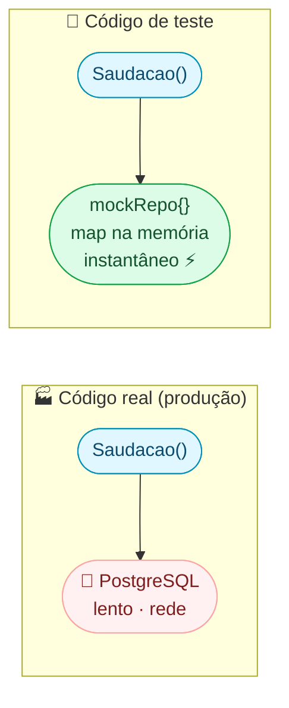
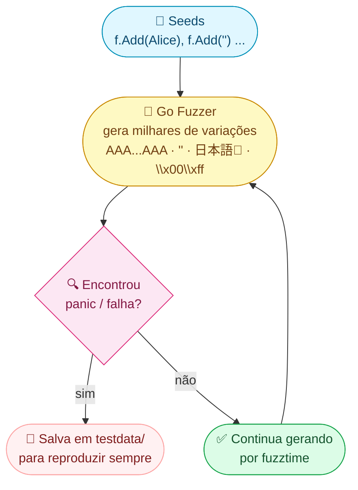
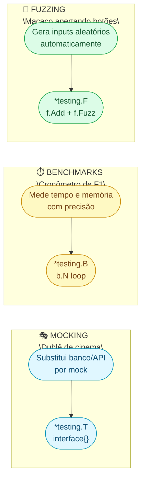

No módulo básico você viu `t.Run`, `t.Helper()`, cobertura, `httptest` e subtests paralelos com `t.Parallel()`. Agora vamos às **3 técnicas** que separam testes básicos de suites profissionais:

1. **Mocking** — testar código que depende de banco/API **sem** banco/API
2. **Benchmarks** — medir **exatamente** quão rápido seu código é
3. **Fuzzing** — deixar o computador **inventar** inputs que quebram seu código

---

## 1. Mocking: Testar Sem Depender de Nada Externo

### O problema

Imagine que você tem um serviço que busca usuários no banco de dados:

```go
func Saudacao(repo BancoDeDados, id string) (string, error) {
    usuario, err := repo.BuscarPorID(id)
    if err != nil {
        return "", err
    }
    return "Olá, " + usuario.Nome + "!", nil
}
```

Para testar essa função, você precisaria de um banco de dados rodando? **Não!** Isso seria lento, frágil e complicado.

### Analogia: ator dublê de cinema

Em filmes de ação, o ator principal não pula do prédio — um **dublê** faz isso. No teste, o banco de dados real não participa — um **mock** (dublê) faz o papel dele.

### Passo a passo: criando um mock em Go

**Passo 1:** defina a dependência como **interface** (o "contrato"):

```go
type UserRepo interface {
    BuscarPorID(id string) (*User, error)
}

type User struct {
    ID   string
    Nome string
}

var ErrNaoEncontrado = errors.New("usuário não encontrado")
```

**Passo 2:** crie o mock (o "dublê"):

```go
// mockRepo é o dublê do banco de dados
type mockRepo struct {
    usuarios map[string]*User  // banco fake: só um map!
}

func (m *mockRepo) BuscarPorID(id string) (*User, error) {
    u, ok := m.usuarios[id]
    if !ok {
        return nil, ErrNaoEncontrado
    }
    return u, nil
}
```

**Passo 3:** use o mock no teste:

```go
func TestSaudacao(t *testing.T) {
    // Cria o "banco fake" com dados controlados
    mock := &mockRepo{
        usuarios: map[string]*User{
            "1": {ID: "1", Nome: "Alice"},
        },
    }

    t.Run("usuário existe", func(t *testing.T) {
        msg, err := Saudacao(mock, "1")
        if err != nil {
            t.Fatal("erro inesperado:", err)
        }
        if msg != "Olá, Alice!" {
            t.Errorf("got %q; want %q", msg, "Olá, Alice!")
        }
    })

    t.Run("usuário não existe", func(t *testing.T) {
        _, err := Saudacao(mock, "999")
        if !errors.Is(err, ErrNaoEncontrado) {
            t.Errorf("got %v; want ErrNaoEncontrado", err)
        }
    })
}
```

### O que aconteceu?



> **Regra de ouro do mocking em Go:** defina dependências como **interfaces**, não como structs concretas. Assim, o teste substitui a implementação real por um mock **sem mudar nenhuma linha do código de produção**.

### Por que Go não precisa de framework de mock?

| Linguagem | Mock como? |
|-----------|-----------|
| Java | Framework (Mockito) gera proxy em runtime |
| Python | `unittest.mock` com monkey-patching |
| **Go** | **Cria struct que implementa a interface** — pronto! |

Em Go, interfaces são implementadas **implicitamente**. Se seu mock tem os mesmos métodos, ele **já implementa** a interface. Sem anotações, sem código gerado.

### Testify: mensagens de erro melhores (opcional)

O Go nativo funciona perfeitamente, mas o **Testify** dá mensagens de erro mais claras:

```go
import "github.com/stretchr/testify/assert"

func TestSaudacaoComTestify(t *testing.T) {
    mock := &mockRepo{usuarios: map[string]*User{
        "1": {ID: "1", Nome: "Alice"},
    }}

    msg, err := Saudacao(mock, "1")

    // Go nativo:
    // if err != nil { t.Fatal(err) }
    // if msg != "Olá, Alice!" { t.Errorf("got %q; want %q", msg, "Olá, Alice!") }

    // Testify — mesma coisa, mais legível:
    assert.NoError(t, err)
    assert.Equal(t, "Olá, Alice!", msg)
    //                ^^^^^^^^^^^   ^^^
    //                esperado      obtido
}
```

| Pacote | O que faz | Quando usar |
|--------|----------|-------------|
| `assert` | Marca erro, **continua** o teste | Verificar múltiplos campos |
| `require` | Marca erro e **para** imediatamente | Setup falhou, sem sentido continuar |

> **Testify é opcional.** O Go nativo (`t.Errorf`, `t.Fatal`) é suficiente. Use Testify se preferir mensagens de erro mais bonitas.

---

## 2. Benchmarks: Cronômetro Científico

### O problema

Você otimizou uma função. Ficou mais rápida? **Não adivinhe — meça.**

### Analogia: cronômetro de F1

Na F1, não medem o tempo com relógio de pulso. Usam cronômetros de milésimos que rodam a volta centenas de vezes. Benchmarks em Go fazem exatamente isso com seu código.

### Como criar um benchmark

**3 regras:**

| Regra | Exemplo | Por quê |
|-------|---------|---------|
| Arquivo termina com `_test.go` | `soma_test.go` | Mesmo arquivo dos testes |
| Função começa com `Benchmark` | `func BenchmarkSoma(...)` | Go reconhece pelo prefixo |
| Recebe `*testing.B` | `func BenchmarkSoma(b *testing.B)` | `b` (não `t`!) controla o benchmark |

### Exemplo completo

```go
// arquivo: soma_test.go

// Jeito lento: concatena com +
func juntarComMais(partes []string) string {
    resultado := ""
    for _, p := range partes {
        resultado += p  // cria string nova a cada +=
    }
    return resultado
}

// Jeito rápido: usa strings.Builder
func juntarComBuilder(partes []string) string {
    var b strings.Builder
    for _, p := range partes {
        b.WriteString(p)  // escreve no mesmo buffer
    }
    return b.String()
}

func BenchmarkJuntarComMais(b *testing.B) {
    partes := []string{"Go", " é", " demais", "!"}
    for i := 0; i < b.N; i++ {  // b.N = Go decide quantas vezes
        juntarComMais(partes)
    }
}

func BenchmarkJuntarComBuilder(b *testing.B) {
    partes := []string{"Go", " é", " demais", "!"}
    for i := 0; i < b.N; i++ {
        juntarComBuilder(partes)
    }
}
```

### Rodar o benchmark

```bash
go test -bench=. -benchmem
```

Saída:
```
BenchmarkJuntarComMais-8      3000000    400 ns/op    48 B/op   3 allocs/op
BenchmarkJuntarComBuilder-8  10000000    120 ns/op    16 B/op   1 allocs/op
```

### Como ler cada coluna

```
BenchmarkJuntarComMais-8      3000000    400 ns/op    48 B/op   3 allocs/op
│                        │    │          │            │          │
│                        │    │          │            │          └─ 3 alocações de memória
│                        │    │          │            └─ 48 bytes por operação
│                        │    │          └─ 400 nanossegundos (0.4 microsegundo)
│                        │    └─ rodou 3 milhões de vezes
│                        └─ usou 8 CPUs
└─ nome do benchmark
```

**Conclusão:** Builder é **3x mais rápido** e usa **3x menos memória**. Sem benchmark, você estaria adivinhando.

### Dicas importantes

```go
func BenchmarkComSetupPesado(b *testing.B) {
    // Setup (lento) — não queremos medir isso
    dados := carregarArquivoGrande()

    b.ResetTimer()  // ← "ignore o tempo do setup, comece a contar agora"

    for i := 0; i < b.N; i++ {
        processar(dados)  // ← só isso é medido
    }
}
```

### Comparar antes vs depois

```bash
# 1. Salva resultado ANTES da mudança
go test -bench=. -benchmem -count=5 > antes.txt

# 2. Faz a otimização no código

# 3. Salva resultado DEPOIS
go test -bench=. -benchmem -count=5 > depois.txt

# 4. Compara cientificamente
go install golang.org/x/perf/cmd/benchstat@latest
benchstat antes.txt depois.txt
```

Saída do `benchstat`:
```
                    antes          depois         delta
JuntarComMais-8     400ns ± 2%     120ns ± 1%    -70% (p=0.000)
                                                   ^^^
                                          70% mais rápido! Certeza estatística.
```

---

## 3. Fuzzing: O Computador Testa Coisas Que Você Nem Pensou

### O problema

Você testou sua função com 5 inputs que **você escolheu**. Mas e os milhares de inputs estranhos que **você não pensou**? Strings com emoji? Números gigantes? Caracteres especiais?

### Analogia: macaco apertando botões

Imagine um macaco clicando botões aleatórios do seu programa durante horas. Se algo quebrar, ele avisa. Isso é **fuzzing** — o computador gera inputs aleatórios e vê se algo dá errado.

### Como funciona



### Passo a passo

**3 regras do fuzzing:**

| Regra | Exemplo | Por quê |
|-------|---------|---------|
| Função começa com `Fuzz` | `func FuzzParsear(...)` | Go reconhece pelo prefixo |
| Recebe `*testing.F` | `func FuzzParsear(f *testing.F)` | `f` (não `t`!) controla o fuzzing |
| Seed + Fuzz | `f.Add(...)` + `f.Fuzz(...)` | Exemplos iniciais + gerador automático |

### Exemplo completo

Imagine uma função que parseia idade a partir de string:

```go
func ParsearIdade(s string) (int, error) {
    idade, err := strconv.Atoi(strings.TrimSpace(s))
    if err != nil {
        return 0, fmt.Errorf("idade inválida: %q", s)
    }
    if idade < 0 || idade > 150 {
        return 0, fmt.Errorf("idade fora do range: %d", idade)
    }
    return idade, nil
}
```

O fuzz test:

```go
func FuzzParsearIdade(f *testing.F) {
    // 1. Seeds: exemplos que você conhece
    f.Add("25")
    f.Add("0")
    f.Add("150")
    f.Add("")
    f.Add("abc")

    // 2. Go vai gerar milhares de variações a partir dos seeds
    f.Fuzz(func(t *testing.T, input string) {
        idade, err := ParsearIdade(input)

        // Se não deu erro, a idade deve fazer sentido
        if err == nil {
            if idade < 0 || idade > 150 {
                t.Errorf("ParsearIdade(%q) = %d; deveria estar entre 0-150", input, idade)
            }
        }
        // Se deu erro, ok — a função detectou input inválido
    })
}
```

### Rodar o fuzzing

```bash
# Roda por 30 segundos gerando inputs aleatórios
go test -fuzz=FuzzParsearIdade -fuzztime=30s
```

Saída (se encontrar bug):
```
--- FAIL: FuzzParsearIdade (0.5s)
    --- FAIL: FuzzParsearIdade/abc123 (0.00s)
        idade_test.go:25: ParsearIdade("999") = 999; deveria estar entre 0-150

    Failing input written to testdata/fuzz/FuzzParsearIdade/abc123
```

### O que acontece quando encontra um bug?

```
1. Go salva o input que quebrou em:
   testdata/fuzz/FuzzParsearIdade/abc123

2. Na próxima vez que rodar go test (sem -fuzz),
   esse input é testado AUTOMATICAMENTE

3. Você corrige o bug → testa de novo → passa!
```

> **Quando usar fuzzing:** funções que recebem **input do usuário** — parsers, validadores, decodificadores. O fuzzer encontra edge cases que humanos não pensam.

---

## 4. Profiling nos Testes: Onde Está o Gargalo?

### Analogia: gravação de câmera nos testes

Além de medir tempo (benchmark), você pode gravar **o que seu código fez internamente** durante os testes. Quanto de CPU usou? Quanta memória alocou?

### Como usar

```bash
# Gera CPU profile e memory profile
go test -cpuprofile=cpu.out -memprofile=mem.out -bench=.

# Analisa CPU (onde gasta mais tempo?)
go tool pprof cpu.out
# → (pprof) top 10

# Analisa memória (onde aloca mais?)
go tool pprof mem.out
# → (pprof) top 10

# Visualiza no navegador (gráfico!)
go tool pprof -http=:8081 cpu.out
```

> **Dica:** rode profiling junto com benchmarks (`-bench=.`) para ter dados consistentes. Sem `-bench`, os testes são rápidos demais para coletar amostras significativas.

---

## `TestMain`: Setup e Teardown para o Pacote Inteiro

Às vezes você precisa de um banco de dados de teste, arquivos temporários ou um servidor fake que precisam existir **antes de qualquer teste rodar** — e ser destruídos depois. Para isso existe `TestMain`:

```go
func TestMain(m *testing.M) {
    // 1. Setup: roda ANTES de todos os testes do pacote
    db = abrirBancoDeTeste()
    defer db.Close()

    // 2. m.Run() executa todos os TestXxx, BenchmarkXxx e FuzzXxx
    codigo := m.Run()

    // 3. Teardown: roda DEPOIS de todos os testes
    limparBancoDeTeste(db)

    // 4. Encerra com o código de saída correto (0 = passou, 1 = falhou)
    os.Exit(codigo)
}
```

> **Importante:** se você define `TestMain`, precisa chamar `m.Run()` — caso contrário, nenhum teste roda. E `os.Exit(m.Run())` deve ser a última linha, pois `os.Exit` não executa defers.

| Sem `TestMain` | Com `TestMain` |
|---|---|
| Cada `TestXxx` abre e fecha sua própria conexão | Uma conexão compartilhada — muito mais rápido |
| Não há teardown garantido para o pacote | `defer` ou código após `m.Run()` garante limpeza |
| Simples, ideal para unitários | Necessário para testes de integração |

Você vai usar `TestMain` principalmente quando o módulo de Banco de Dados for integrado em testes — mas o padrão é o mesmo: abrir recurso, `m.Run()`, fechar recurso, `os.Exit`.

---

## Resumo Visual: As 3 Técnicas



---

## Erros Comuns de Iniciante

| Erro | Consequência | Solução |
|------|-------------|---------|
| Testar com banco real | Testes lentos e frágeis | Mock via interface |
| Mock com struct concreta | Impossível substituir no teste | Use **interface** como dependência |
| Benchmark sem `-benchmem` | Não vê alocações (causa #1 de lentidão) | Sempre use `-benchmem` |
| Benchmark com setup no loop | Mede tempo do setup, não do código | `b.ResetTimer()` após setup |
| Não usar fuzzing em parsers | Bugs com inputs estranhos em produção | `go test -fuzz=FuzzX -fuzztime=30s` |
| Rodar `-count=1` no benchmark | Resultado pode ter variação alta | `-count=5` mínimo para consistência |

---

## Preciso de... → Use isso

| Preciso de... | Use |
|---|---|
| Testar sem banco de dados | Mock: interface + struct fake |
| Mensagens de erro mais claras nos testes | `github.com/stretchr/testify` |
| Medir quanto tempo uma função leva | `func BenchmarkX(b *testing.B)` |
| Saber quantas alocações uma função faz | `go test -bench=. -benchmem` |
| Comparar performance antes/depois | `benchstat antes.txt depois.txt` |
| Encontrar bugs com inputs aleatórios | Fuzzing: `func FuzzX(f *testing.F)` |
| Gerar mock automaticamente de interface | `go install go.uber.org/mock/mockgen@latest` |
| Ver onde o tempo é gasto nos testes | `go test -cpuprofile=cpu.out -bench=.` |
