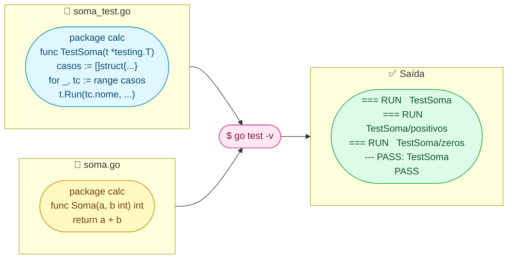

Imagine que você fez um bolo e quer ter **certeza** de que ficou bom antes de servir pros convidados. Você prova um pedaço. Se ficou bom, ótimo. Se ficou ruim, você descobre **antes** de passar vergonha.

Testes em Go são exatamente isso: você **prova** seu código automaticamente. E a melhor parte? Go já vem com tudo pronto — **não precisa instalar nada**.

---

## 1. Seu Primeiro Teste: 3 Regras de Ouro

Para Go reconhecer seus testes, só precisa de **3 coisas**:

| Regra | Exemplo | Por quê |
|-------|---------|---------|
| Arquivo termina com `_test.go` | `soma_test.go` | Go só procura testes nesses arquivos |
| Função começa com `Test` (T maiúsculo) | `func TestSoma(...)` | É assim que Go encontra os testes |
| Recebe `*testing.T` como parâmetro | `func TestSoma(t *testing.T)` | `t` é seu "controle remoto" dos testes |

### Exemplo completo: passo a passo

**Passo 1:** crie o código (arquivo `soma.go`):

```go
package calc

func Soma(a, b int) int {
    return a + b
}
```

**Passo 2:** crie o teste (arquivo `soma_test.go`, **mesmo pacote**):

```go
package calc

import "testing"

func TestSoma(t *testing.T) {
    resultado := Soma(2, 3)

    if resultado != 5 {
        t.Errorf("Soma(2, 3) = %d; esperava 5", resultado)
    }
}
```

**Passo 3:** rode o teste:

```bash
go test -v
```

Saída:
```
=== RUN   TestSoma
--- PASS: TestSoma (0.00s)
PASS
ok      calc    0.001s
```

> **`-v`** = verbose. Sem ele, Go só mostra algo se o teste **falhar**. Com `-v`, mostra cada teste rodando.

---

## 2. `t.Error` vs `t.Fatal`: Quando Parar?

### Analogia: prova na escola

- **`t.Error`** = professor marca a questão errada com X, mas **continua corrigindo** as próximas
- **`t.Fatal`** = professor para de corrigir imediatamente ("nem preciso ver o resto")

```go
func TestExemplo(t *testing.T) {
    // t.Error — marca erro, mas CONTINUA
    if Soma(1, 1) != 2 {
        t.Error("1+1 deveria ser 2")  // ← continua pro próximo teste
    }

    // t.Fatal — marca erro e PARA
    conn, err := ConectarBanco()
    if err != nil {
        t.Fatal("Sem banco, não tem como continuar")  // ← para aqui
    }
    // ... testes que precisam do banco ...
}
```

### Quando usar cada um?

| Situação | Use | Por quê |
|----------|-----|---------|
| Verificar resultado de cálculo | `t.Error` | Outros testes ainda podem passar |
| Setup falhou (banco, arquivo) | `t.Fatal` | Sem setup, nada mais faz sentido |
| Verificar vários campos | `t.Error` | Quer ver **todos** os erros de uma vez |

---

## 3. Table-Driven Tests: O Padrão Que Todo Dev Go Usa

### O problema

Imagine testar a função `Soma` com 5 combinações diferentes:

```go
// ❌ Repetitivo e chato
func TestSoma(t *testing.T) {
    if Soma(1, 2) != 3 { t.Error("1+2") }
    if Soma(0, 0) != 0 { t.Error("0+0") }
    if Soma(-1, 1) != 0 { t.Error("-1+1") }
    if Soma(100, 200) != 300 { t.Error("100+200") }
    if Soma(-5, -3) != -8 { t.Error("-5+-3") }
}
```

Funciona, mas é **repetitivo**. Se quiser adicionar mais um caso, precisa copiar e colar toda a estrutura.

### A solução: table-driven tests

```go
// ✅ Table-driven: limpo e fácil de estender
func TestSoma(t *testing.T) {
    // 1. Cria uma "tabela" de casos
    casos := []struct {
        nome     string  // descrição do caso
        a, b     int     // inputs
        esperado int     // resultado esperado
    }{
        {"positivos", 1, 2, 3},
        {"zeros", 0, 0, 0},
        {"negativos", -1, -2, -3},
        {"misto", -5, 10, 5},
        {"grandes", 1000, 2000, 3000},
    }

    // 2. Roda cada caso como um subtest separado
    for _, tc := range casos {
        t.Run(tc.nome, func(t *testing.T) {
            got := Soma(tc.a, tc.b)
            if got != tc.esperado {
                t.Errorf("Soma(%d, %d) = %d; esperava %d",
                    tc.a, tc.b, got, tc.esperado)
            }
        })
    }
}
```

Saída com `go test -v`:
```
=== RUN   TestSoma
=== RUN   TestSoma/positivos
=== RUN   TestSoma/zeros
=== RUN   TestSoma/negativos
=== RUN   TestSoma/misto
=== RUN   TestSoma/grandes
--- PASS: TestSoma (0.00s)
    --- PASS: TestSoma/positivos (0.00s)
    --- PASS: TestSoma/zeros (0.00s)
    --- PASS: TestSoma/negativos (0.00s)
    --- PASS: TestSoma/misto (0.00s)
    --- PASS: TestSoma/grandes (0.00s)
```

### Por que isso é genial?

| Vantagem | Explicação |
|----------|-----------|
| Adicionar caso = **1 linha** | `{"novo caso", 7, 8, 15},` |
| Cada caso tem **nome** | Fácil saber qual falhou |
| Rodar **só um caso** | `go test -run TestSoma/negativos` |
| Menos código repetido | Loop faz o trabalho |

### Como rodar só um subtest específico

```bash
# Roda todos os testes
go test ./...

# Roda só TestSoma
go test -run TestSoma

# Roda só o subtest "negativos" dentro de TestSoma
go test -run TestSoma/negativos
```

---

## 4. `t.Helper()`: Funções Auxiliares Sem Confusão

### O problema

Quando você cria uma função auxiliar para evitar repetição:

```go
func assertIgual(t *testing.T, got, want int) {
    if got != want {
        t.Errorf("got %d; want %d", got, want)
        //       ^^^^^^^^^^^^^^^^^^^^^^^^^^^^^^^^
        //       Erro aponta para ESTA linha (dentro do helper)
        //       Mas você quer saber ONDE chamou o helper!
    }
}
```

Se o teste falha, Go diz "erro na linha 3 de assertIgual" — mas você quer saber **qual teste** chamou o `assertIgual`!

### A solução: `t.Helper()`

```go
func assertIgual(t *testing.T, got, want int) {
    t.Helper()  // ← "eu sou auxiliar, aponte pro meu caller"
    if got != want {
        t.Errorf("got %d; want %d", got, want)
        // Agora o erro aponta para quem CHAMOU assertIgual ✅
    }
}

func TestSoma(t *testing.T) {
    assertIgual(t, Soma(2, 3), 5)   // ← erro apontaria pra ESTA linha
    assertIgual(t, Soma(0, 0), 0)
}
```

> **Regra:** sempre que criar uma função que recebe `*testing.T` e não é um `TestXxx`, coloque `t.Helper()` na primeira linha.

---

## 5. Cobertura: Quanto do Seu Código Está Testado?

### Analogia: prova com 10 questões

Se você estudou 8 das 10 questões, sua cobertura é **80%**. Cobertura de testes é a mesma ideia: quantos **%** das linhas do seu código são executados pelos testes.

### 3 comandos que você precisa saber

```bash
# 1. Ver a porcentagem direto no terminal
go test -cover
# Saída: coverage: 85.7% of statements

# 2. Gerar arquivo com detalhes
go test -coverprofile=cobertura.out

# 3. Abrir no navegador (visual, colorido!)
go tool cover -html=cobertura.out
```

O comando 3 abre uma página assim:

```
 ██ Verde  = linhas que seus testes executaram
 ██ Vermelho = linhas que NENHUM teste passou
```

### Quanto de cobertura é "bom"?

| Cobertura | Avaliação |
|-----------|-----------|
| < 50% | ⚠️ Muita coisa sem teste |
| 60-80% | ✅ Bom para a maioria dos projetos |
| 80-90% | ✅ Muito bom |
| 100% | ⚠️ Nem sempre vale o esforço |

> **Cuidado:** 100% de cobertura **não significa** que seu código está correto. Você pode ter 100% testando coisas óbvias e perdendo edge cases. **80% com casos bem escolhidos vale mais que 100% com asserts triviais.**

---

## 6. HTTP Testing: Testar APIs Sem Subir Servidor

### O problema

Você escreveu um handler HTTP e quer testar. Precisa subir o servidor todo, fazer request com curl? **Não!** Go tem o `httptest` que cria um "servidor fake" em memória.

### Analogia: simulador de voo

Pilotos treinam em simuladores — não precisam de um avião de verdade. O `httptest` é o simulador: testa seu handler **sem abrir porta, sem rede, sem servidor de verdade**.

### Passo a passo

**Passo 1:** o handler que queremos testar:

```go
func OlaHandler(w http.ResponseWriter, r *http.Request) {
    w.Header().Set("Content-Type", "application/json")
    w.WriteHeader(http.StatusOK)
    w.Write([]byte(`{"msg": "olá, mundo!"}`))
}
```

**Passo 2:** o teste com httptest:

```go
func TestOlaHandler(t *testing.T) {
    // 1. Cria uma request fake (sem rede)
    req := httptest.NewRequest("GET", "/ola", nil)

    // 2. Cria um "gravador" que captura a response
    rec := httptest.NewRecorder()

    // 3. Chama o handler diretamente (sem servidor!)
    OlaHandler(rec, req)

    // 4. Verifica o resultado
    if rec.Code != http.StatusOK {
        t.Errorf("Status = %d; esperava 200", rec.Code)
    }

    if ct := rec.Header().Get("Content-Type"); ct != "application/json" {
        t.Errorf("Content-Type = %q; esperava application/json", ct)
    }

    body := rec.Body.String()
    if !strings.Contains(body, "olá") {
        t.Errorf("Body = %q; esperava conter 'olá'", body)
    }
}
```

### O que cada peça faz

```
httptest.NewRequest("GET", "/ola", nil)
│                    │      │      └─ body (nil = sem body)
│                    │      └─ URL
│                    └─ método HTTP
└─ cria request fake, sem rede

httptest.NewRecorder()
└─ cria um "gravador" que salva tudo que o handler escreveu:
   rec.Code       → status HTTP (200, 404, 500...)
   rec.Body       → conteúdo da resposta
   rec.Header()   → headers da resposta
```

### Recorder vs Server: qual usar?

| Ferramenta | O que faz | Quando usar |
|------------|----------|-------------|
| `httptest.NewRecorder()` | Chama handler diretamente | Testes unitários (rápido, sem rede) |
| `httptest.NewServer(mux)` | Sobe servidor real em porta aleatória | Testes de integração (com middleware, routing) |

Exemplo com Server:
```go
func TestIntegracao(t *testing.T) {
    srv := httptest.NewServer(http.HandlerFunc(OlaHandler))
    defer srv.Close()  // importante: fechar o servidor!

    // Faz request HTTP real para o servidor de teste
    resp, err := http.Get(srv.URL + "/ola")
    if err != nil {
        t.Fatal(err)
    }
    defer resp.Body.Close()

    if resp.StatusCode != 200 {
        t.Errorf("Status = %d; esperava 200", resp.StatusCode)
    }
}
```

---

## Resumo Visual: Anatomia de Um Teste em Go



---

## Comandos Que Você Vai Usar Todo Dia

| Comando | O que faz |
|---------|----------|
| `go test` | Roda todos os testes do pacote |
| `go test -v` | Mostra cada teste rodando |
| `go test ./...` | Roda testes de **todos** os pacotes |
| `go test -run TestSoma` | Roda só testes que casam com "TestSoma" |
| `go test -run TestSoma/zeros` | Roda só o subtest "zeros" |
| `go test -cover` | Mostra % de cobertura |
| `go test -coverprofile=c.out` | Gera arquivo de cobertura |
| `go tool cover -html=c.out` | Abre cobertura visual no navegador |
| `go test -count=1` | Ignora cache (sempre roda de verdade) |

---

## Erros Comuns de Iniciante

| Erro | Consequência | Solução |
|------|-------------|---------|
| Arquivo não termina com `_test.go` | Go não encontra os testes | Renomeie: `calc_test.go` |
| Função não começa com `Test` (T maiúsculo) | Go ignora a função | `TestSoma`, não `testSoma` |
| Esqueceu `t.Helper()` no auxiliar | Erro aponta pra linha errada | Primeira linha: `t.Helper()` |
| Usar `t.Fatal` em vez de `t.Error` | Para no primeiro erro, perde os outros | Use `t.Error` para ver tudo |
| Não usar `-v` e achar que não rodou | Testes passaram, mas saída ficou vazia | `go test -v` |

---

## Preciso de... → Use isso

| Preciso de... | Use |
|---|---|
| Testar uma função simples | `func TestX(t *testing.T)` + `t.Errorf` |
| Testar 10 variações da mesma função | Table-driven test com `t.Run` |
| Testar um handler HTTP sem servidor | `httptest.NewRecorder()` |
| Testar com servidor HTTP real | `httptest.NewServer(handler)` |
| Saber quanto está testado | `go test -cover` |
| Ver visualmente o que falta testar | `go tool cover -html=c.out` |
| Rodar só um teste específico | `go test -run NomeDaFunção` |
