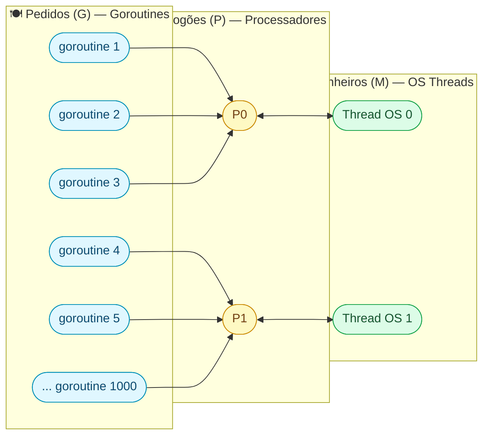
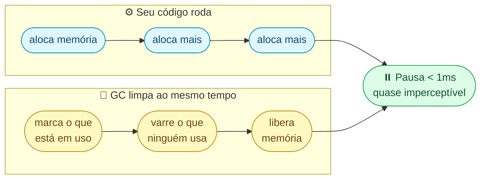

Imagine que seu programa Go está lento. Como descobrir **onde** está o problema? Você não adivinha — você usa ferramentas que mostram **exatamente** onde o tempo e a memória estão sendo gastos. É como levar o carro no mecânico que pluga o computador de diagnóstico.

Vamos entender **como Go funciona por dentro** e depois aprender a usar as ferramentas de diagnóstico.

---

## 1. Como Go Roda Por Dentro: O Modelo M:P:G

### Analogia: restaurante

Imagine um restaurante:

- **G (Goroutines)** = os **pedidos** dos clientes (podem ser milhares)
- **P (Processadores)** = os **fogões** da cozinha (geralmente 1 por CPU)
- **M (Threads)** = os **cozinheiros** que usam os fogões



### Por que isso importa?

| Recurso | Goroutine (G) | Thread do OS (M) |
|---------|---------------|-------------------|
| Memória inicial | **2 KB** | **1-8 MB** |
| Criar 10.000 | ✅ Tranquilo | ❌ Sistema trava |
| Quem gerencia | Go scheduler | Sistema operacional |
| Cresce | Automaticamente | Tamanho fixo |

É por isso que Go aguenta milhares de goroutines — cada uma começa com só **2 KB** de memória e cresce conforme precisa.

### Como verificar

```go
fmt.Println("CPUs:", runtime.NumCPU())           // fogões disponíveis
fmt.Println("Goroutines:", runtime.NumGoroutine()) // pedidos ativos
fmt.Println("GOMAXPROCS:", runtime.GOMAXPROCS(0))  // fogões em uso
```

> **Dica:** se `NumGoroutine()` só cresce e nunca diminui, você tem um **goroutine leak** (vazamento). Alguma goroutine está travada esperando algo que nunca chega.

---

## 2. O Coletor de Lixo (GC): Faxineiro Automático

### Analogia: faxineiro do restaurante

Enquanto os cozinheiros trabalham, o faxineiro (GC) limpa as mesas usadas (memória que não é mais necessária) — **sem fechar o restaurante**. Ele trabalha ao mesmo tempo que a cozinha funciona.

### Como funciona (simplificado)



### Controlando o faxineiro

| Variável | O que faz | Padrão | Analogia |
|----------|-----------|--------|----------|
| `GOGC=100` | GC roda quando heap dobra de tamanho | 100 | Faxineiro limpa quando a sujeira dobra |
| `GOGC=50` | GC roda mais frequentemente | — | Faxineiro mais ativo, menos sujeira |
| `GOGC=200` | GC roda menos frequentemente | — | Faxineiro mais preguiçoso, mais sujeira |
| `GOMEMLIMIT=512MiB` | Limite máximo de memória | sem limite | "Nosso restaurante só tem 512m² de espaço" |

Exemplo:
```bash
# Faxineiro mais agressivo (menos memória, mais CPU)
GOGC=50 go run main.go

# Faxineiro mais preguiçoso (mais memória, menos CPU)
GOGC=200 go run main.go

# Limite máximo de 512MB
GOMEMLIMIT=512MiB go run main.go
```

### Ver o faxineiro trabalhando em tempo real

```bash
GODEBUG=gctrace=1 go run main.go
```

Saída:
```
gc 1 @0.012s 2%: 0.010+1.2+0.005 ms clock, ...
^^        ^^
│         └─ 2% do tempo total gasto no GC
└─ ciclo número 1
```

> Se o GC está usando mais de **10-15%** do tempo, seu programa está alocando memória demais.

---

## 3. Benchmarks: Cronômetro Científico

### Analogia: cronômetro de laboratório

Você não mede performance com `time.Now()` — isso é como cronometrar uma corrida com relógio de parede. Go tem um cronômetro de **laboratório** que roda a função milhares de vezes automaticamente.

### Como criar um benchmark

```go
// arquivo: meu_test.go (DEVE terminar com _test.go)

func BenchmarkConcatComMais(b *testing.B) {
    // b.N = Go decide quantas vezes rodar
    for i := 0; i < b.N; i++ {
        resultado := ""
        for j := 0; j < 100; j++ {
            resultado += "x"  // ❌ lento: cria string nova a cada +
        }
    }
}

func BenchmarkConcatComBuilder(b *testing.B) {
    for i := 0; i < b.N; i++ {
        var b strings.Builder
        for j := 0; j < 100; j++ {
            b.WriteString("x")  // ✅ rápido: escreve no mesmo buffer
        }
        _ = b.String()
    }
}
```

### Rodar o benchmark

```bash
go test -bench=. -benchmem
```

Saída:
```
BenchmarkConcatComMais-8      50000    30000 ns/op   5000 B/op   99 allocs/op
BenchmarkConcatComBuilder-8  500000     3000 ns/op    200 B/op    5 allocs/op
```

### Como ler o resultado

```
BenchmarkConcatComMais-8      50000    30000 ns/op   5000 B/op   99 allocs/op
│                        │    │        │             │            │
│                        │    │        │             │            └─ 99 alocações por operação
│                        │    │        │             └─ 5000 bytes por operação
│                        │    │        └─ 30 microsegundos por operação
│                        │    └─ rodou 50.000 vezes
│                        └─ usou 8 CPUs
└─ nome da função
```

> **Regra:** `-benchmem` é **obrigatório**. Sem ele você vê só o tempo, não as alocações. E alocações são o #1 problema de performance em Go.

### Comparando antes/depois

```bash
# Salvar resultado antes da otimização
go test -bench=. -benchmem -count=5 > antes.txt

# (faz a mudança no código)

# Salvar resultado depois
go test -bench=. -benchmem -count=5 > depois.txt

# Comparar
go install golang.org/x/perf/cmd/benchstat@latest
benchstat antes.txt depois.txt
```

---

## 4. pprof — O Raio-X do Seu Programa

### Analogia: exame de sangue

pprof é como um exame de sangue para seu programa. Ele coleta amostras durante um período e mostra **exatamente onde** o tempo e a memória estão sendo gastos.

### Passo 1: Ativar o pprof

Adicione **uma linha** ao seu programa:

```go
import _ "net/http/pprof"  // ← só isso!

func main() {
    // Inicia servidor de diagnóstico em porta separada
    go func() {
        http.ListenAndServe(":6060", nil)
    }()

    // ... seu código normal aqui ...
}
```

> **⚠️ SEGURANÇA:** nunca exponha a porta 6060 na internet! O pprof abre acesso total ao diagnóstico do programa. Use apenas em localhost ou rede interna.

### Passo 2: Coletar CPU profile

Enquanto o programa roda, abra **outro terminal**:

```bash
# Coleta 30 segundos de dados de CPU
go tool pprof http://localhost:6060/debug/pprof/profile?seconds=30
```

Isso abre um shell interativo:

```
(pprof) top 10
Showing top 10 nodes
      flat  flat%   sum%  cum   cum%
      2.5s  50.0%  50.0%  2.5s  50.0%  main.processarDados
      1.0s  20.0%  70.0%  1.0s  20.0%  runtime.mallocgc
      ...
```

```
 flat  = tempo gasto DENTRO da função
 cum   = tempo gasto na função + tudo que ela chama
 50.0% = processarDados usa METADE do tempo total!
         ^^^^^^^^^^^^^ ← ESSE é seu bottleneck
```

### Passo 3: Visualizar no navegador

```bash
go tool pprof -http=:8081 profile.pb.gz
```

Abre um gráfico no navegador onde blocos **maiores e mais vermelhos** = mais tempo gasto. Você **vê** literalmente onde está o problema.

### Passo 4: Coletar heap profile (memória)

```bash
go tool pprof http://localhost:6060/debug/pprof/heap
```

```
(pprof) top
      1.5GB  60.0%  main.processarDados   ← essa função aloca 60% da memória!
```

### Resumo dos endpoints

| Endpoint | O que mostra |
|----------|-------------|
| `/debug/pprof/profile?seconds=30` | Onde a CPU gasta tempo |
| `/debug/pprof/heap` | Onde a memória é alocada |
| `/debug/pprof/goroutine` | Todas as goroutines (útil para leaks) |
| `/debug/pprof/block` | Onde goroutines ficam bloqueadas |
| `/debug/pprof/mutex` | Contenção de mutex |

---

## 5. trace — O Filme do Seu Programa

### Analogia: câmera de segurança

Se o pprof é um exame de sangue (resumo), o trace é uma **câmera de segurança** — mostra tudo que aconteceu, segundo a segundo: goroutines criadas, GC rodando, quem esperou quem.

```bash
# Gerar trace
go test -trace=trace.out ./...

# Abrir no navegador
go tool trace trace.out
```

Abre uma timeline interativa onde você vê:

```
Goroutine 1: ████████░░░░████████  (rodando/esperando/rodando)
Goroutine 2: ░░░████████░░░░░░░░  (esperando/rodando/terminando)
GC:          ░░░░░░░█░░░░░░░█░░░  (duas pausas de GC)
```

> **Quando usar:** quando pprof mostra que "está lento" mas você não entende **por quê**. O trace mostra a sequência exata de eventos.

---

## 6. Escape Analysis — Onde Suas Variáveis Moram

### Analogia: mesa de trabalho vs depósito

Variáveis podem morar em dois lugares:

| Lugar | Nome técnico | Velocidade | Quem limpa |
|-------|-------------|------------|-----------|
| **Mesa de trabalho** | Stack | Ultra rápido | Automático (sai da função, sumiu) |
| **Depósito** | Heap | Mais lento | Coletor de lixo (GC) |

Go decide automaticamente onde cada variável vai. Mas você pode **ver** essas decisões:

```bash
go build -gcflags="-m" ./...
```

Saída:
```
./main.go:10: x escapes to heap        ← foi pro depósito (GC precisa limpar)
./main.go:15: y does not escape         ← ficou na mesa (rápido, sem GC)
```

### Quando uma variável escapa?

```go
// ✅ NÃO escapa — fica na stack (rápido)
func soma(a, b int) int {
    resultado := a + b  // resultado fica na stack
    return resultado    // retorna cópia do valor
}

// ❌ ESCAPA — vai pro heap (mais lento)
func novaPessoa(nome string) *Pessoa {
    p := Pessoa{Nome: nome}  // p escapa pro heap!
    return &p                 // porque retornamos um ponteiro
}
```

> **Regra prática:** retornar **ponteiro** para variável local = ela escapa pro heap. No dia a dia não se preocupe, mas em **hot paths** (funções chamadas milhões de vezes), isso importa.

---

## 7. Diagnóstico Rápido em Runtime

Para ter um "painel de controle" do seu programa:

```go
func diagnostico() {
    var m runtime.MemStats
    runtime.ReadMemStats(&m)

    fmt.Println("=== Diagnóstico ===")
    fmt.Printf("Goroutines ativas:  %d\n", runtime.NumGoroutine())
    fmt.Printf("CPUs disponíveis:   %d\n", runtime.NumCPU())
    fmt.Printf("Heap em uso:        %d MB\n", m.Alloc/1024/1024)
    fmt.Printf("Total já alocado:   %d MB\n", m.TotalAlloc/1024/1024)
    fmt.Printf("Ciclos de GC:       %d\n", m.NumGC)
}
```

Saída:
```
=== Diagnóstico ===
Goroutines ativas:  42
CPUs disponíveis:   8
Heap em uso:        15 MB
Total já alocado:   230 MB    ← se muito maior que Heap, está alocando e liberando muito
Ciclos de GC:       89
```

---

## Workflow Completo: Do "Está Lento" ao "Resolvido"

```mermaid
flowchart TD
  start(["🐌 \"Meu programa está lento!\""])
  s1(["📏 1. Benchmark\ngo test -bench -benchmem\nMede o tamanho do problema\nquanto tempo? quantas alocações?"])
  s2(["🔬 2. pprof CPU profile\ngo tool pprof .../profile\nDescobre ONDE está o problema\nqual função gasta mais tempo?"])
  s3(["🧠 3. pprof Heap profile\ngo tool pprof .../heap\nDescobre se é memória\nqual função aloca mais?"])
  s4(["🔍 4. Escape analysis\ngo build -gcflags=\"-m\"\nPor que aloca tanto?\no que escapa pro heap?"])
  s5(["✅ 5. Otimiza + benchmark\nCorrige o bottleneck\nmede de novo: melhorou?"])

  start --> s1 --> s2 --> s3 --> s4 --> s5

  style start fill:#fff1f2,stroke:#fca5a5,color:#7f1d1d
  style s1    fill:#e0f7ff,stroke:#0090b8,color:#0c4a6e
  style s2    fill:#fef9c3,stroke:#ca8a04,color:#713f12
  style s3    fill:#fce7f3,stroke:#db2777,color:#831843
  style s4    fill:#fef9c3,stroke:#ca8a04,color:#713f12
  style s5    fill:#dcfce7,stroke:#16a34a,color:#14532d
```

---

## Erros Comuns de Iniciante

| Erro | Por que é problemático | Solução |
|------|----------------------|---------|
| Medir com `time.Now()` | Impreciso, não conta alocações | Use `testing.B` (benchmarks) |
| Otimizar sem medir | Perde tempo no lugar errado | **Sempre** profile primeiro |
| Ignorar `-benchmem` | Não vê alocações (causa #1 de lentidão) | `go test -bench=. -benchmem` |
| pprof aberto na internet | Expõe diagnóstico completo | Apenas localhost ou rede interna |
| `NumGoroutine` crescendo | Goroutine leak | Verifique goroutines com pprof |
| `GOGC=off` em produção | Memória cresce infinitamente | Use `GOMEMLIMIT` em vez disso |

---

## Preciso de... → Use isso

| Preciso de... | Use |
|---|---|
| Medir se minha mudança melhorou | `go test -bench=. -benchmem` |
| Saber onde a CPU gasta mais tempo | `pprof` → CPU profile |
| Saber onde a memória é alocada | `pprof` → heap profile |
| Ver goroutines, GC e scheduling | `go tool trace` |
| Saber o que escapa pro heap | `go build -gcflags="-m"` |
| Ajustar frequência do GC | `GOGC=50` / `GOGC=200` |
| Limitar memória total | `GOMEMLIMIT=512MiB` |
| Ver GC em tempo real | `GODEBUG=gctrace=1` |
| Comparar benchmarks antes/depois | `benchstat antes.txt depois.txt` |
