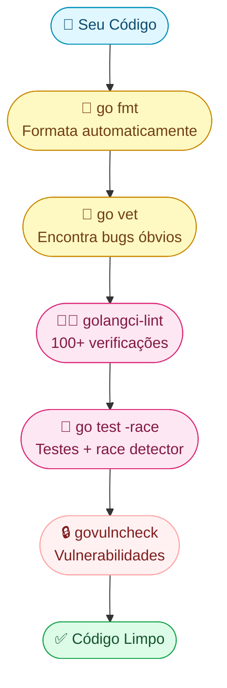

Imagine que você escreveu uma redação e precisa entregar ela perfeita. Você faria **3 coisas**:

1. **Corrigir a formatação** (margens, espaçamento) → isso é o `go fmt`
2. **Passar o corretor ortográfico** (erros de português) → isso é o `go vet`
3. **Pedir para alguém revisar** (problemas que você não vê) → isso é o `golangci-lint`

Go tem ferramentas **oficiais e gratuitas** para cada etapa. Vamos conhecer uma por uma.

---

## 1. `go fmt` — O Formatador Automático

### O problema que resolve

Em outras linguagens, times brigam por estilo: "tabs ou espaços?", "chave na mesma linha?". Em Go, **não existe essa discussão**. Todo código Go do mundo tem o **mesmo estilo**.

### Como funciona

```bash
go fmt ./...
```

Antes do `go fmt`:
```go
package main
import "fmt"
func main(){
x:=42
  fmt.Println(  x  )
}
```

Depois do `go fmt`:
```go
package main

import "fmt"

func main() {
	x := 42
	fmt.Println(x)
}
```

> **Dica:** use `goimports` em vez de `go fmt`. Ele faz tudo que o `go fmt` faz **E ainda organiza seus imports** (remove os que não usa, adiciona os que faltam):
> ```bash
> goimports -w .
> ```
> Instalação: `go install golang.org/x/tools/cmd/goimports@latest`

---

## 2. `go vet` — O Detector de Bugs Silenciosos

### Analogia: alarme de fumaça

`go vet` é como um **alarme de fumaça**. Seu código compila e roda, mas tem um bug escondido que pode causar incêndio. O `vet` detecta esses bugs **antes** de dar problema.

### Bugs que ele encontra

| Bug | Exemplo | O que acontece |
|-----|---------|----------------|
| Printf errado | `fmt.Printf("%d", "texto")` | `%d` espera número, recebeu string |
| Mutex copiado | `m2 := m1` (onde m1 é sync.Mutex) | Copia o lock → race condition |
| Struct tag errada | `` `json:nome` `` (falta aspas) | JSON ignora o campo silenciosamente |
| Código inalcançável | `return` antes de outra linha | Linha nunca executa |

### Como usar

```bash
go vet ./...
```

Exemplo de problema detectado:

```go
// ❌ go vet vai reclamar
fmt.Printf("Idade: %d anos\n", "vinte")
//                  ^^              ^^^^^
//                  espera int      recebeu string

// ✅ Correto
fmt.Printf("Idade: %d anos\n", 20)
```

> **Regra de ouro:** `go vet` tem **zero falsos positivos**. Se ele reclamou, **é bug de verdade**. Sempre confie.

---

## 3. `golangci-lint` — O Super Revisor

### Analogia: equipe de revisores

Imagine que em vez de **um** revisor, você tem **100 revisores** lendo seu código ao mesmo tempo. Cada um procura um tipo diferente de problema. Esse é o `golangci-lint`.

### Instalação

```bash
go install github.com/golangci/golangci-lint/cmd/golangci-lint@latest
```

### Como usar

```bash
golangci-lint run
```

### Os revisores mais importantes

| Linter (revisor) | O que procura | Exemplo |
|---|---|---|
| `staticcheck` | Bugs e código morto | Variável usada mas nunca lida |
| `errcheck` | Erros ignorados | `file.Close()` sem checar erro |
| `gosec` | Problemas de segurança | SQL injection, senhas hardcoded |
| `revive` | Estilo e boas práticas | Função exportada sem comentário |
| `gocritic` | Código que pode melhorar | `if err != nil { return err }` redundante |

### Configurando: `.golangci.yml`

Crie esse arquivo na raiz do projeto para escolher quais "revisores" ativar:

```yaml
# .golangci.yml — coloque na raiz do projeto
linters:
  enable:
    - staticcheck    # bugs
    - errcheck       # erros ignorados
    - gosec          # segurança
    - revive         # boas práticas
    - gocritic       # melhorias

linters-settings:
  revive:
    rules:
      - name: exported
```

### Exemplo prático: errcheck em ação

```go
// ❌ Dois problemas: (1) errcheck reclama; (2) se o arquivo não existir,
//    file é nil e defer file.Close() causa PANIC em runtime
file, _ := os.Open("dados.txt")
defer file.Close()

// ✅ Correto — sempre trate o erro
file, err := os.Open("dados.txt")
if err != nil {
    log.Fatal(err)
}
defer file.Close()
```

---

## 4. `govulncheck` — O Detector de Vulnerabilidades

### Analogia: recall de carro

Sabe quando uma montadora faz recall porque descobriu um defeito? O `govulncheck` faz isso com suas **dependências Go**. Ele verifica se algum pacote que você usa tem uma vulnerabilidade conhecida.

### O diferencial

Outras ferramentas olham só o `go.mod` (lista de dependências). O `govulncheck` é mais inteligente — ele verifica **quais funções você realmente chama**. Se a vulnerabilidade está numa função que você não usa, ele avisa mas não alarma.

### Como usar

```bash
# Instalar
go install golang.org/x/vuln/cmd/govulncheck@latest

# Rodar
govulncheck ./...
```

Saída exemplo:
```
Vulnerability #1: GO-2024-1234
    Package: golang.org/x/net
    Found in: golang.org/x/net@v0.10.0
    Fixed in: golang.org/x/net@v0.17.0
    → Seu código CHAMA a função vulnerável!
```

**Solução:** atualize a dependência:
```bash
go get golang.org/x/net@latest
```

---

## 5. `go test -race` — O Detector de Data Races

### Analogia: duas pessoas editando o mesmo documento

Imagine duas pessoas editando a mesma célula de uma planilha ao mesmo tempo, sem saber uma da outra. O resultado? Dados corrompidos. Isso é um **data race**.

```bash
go test -race ./...
```

Exemplo de data race:

```go
// ❌ DATA RACE — duas goroutines escrevem em 'contador'
contador := 0
go func() { contador++ }()
go func() { contador++ }()
// Resultado: pode ser 1 ou 2, nunca se sabe!

// ✅ Sem race — usa sync.Mutex
var mu sync.Mutex
contador := 0
go func() { mu.Lock(); contador++; mu.Unlock() }()
go func() { mu.Lock(); contador++; mu.Unlock() }()
// Resultado: sempre 2
```

> **Atenção:** o flag `-race` deixa o programa mais lento (~2-20x) e usa mais memória (~5-10x). Use **apenas em testes e CI**, nunca em produção.

---

## 6. Próximos Passos: Performance

Você agora tem código correto e seguro. O próximo passo é **medir e otimizar** desempenho — `go test -bench`, `pprof` e escape analysis (`go build -gcflags="-m"`). Isso é tema da próxima aula: **Profiling, Runtime e Otimização**.

---

## Resumo Visual: O Pipeline de Qualidade



---

## Conjunto Mínimo para CI (Integração Contínua)

Se você só pode escolher **4 comandos** para rodar automaticamente:

| # | Comando | O que faz | Por que é essencial |
|---|---------|-----------|---------------------|
| 1 | `go vet ./...` | Bugs óbvios | Zero falsos positivos |
| 2 | `go test -race ./...` | Testes + races | Pega bugs de concorrência |
| 3 | `golangci-lint run` | 100+ verificações | Padrão da indústria |
| 4 | `govulncheck ./...` | Vulnerabilidades | Segurança das dependências |

### Makefile pronto para copiar

```makefile
.PHONY: check

check: ## Roda tudo de uma vez
	goimports -w .
	go vet ./...
	golangci-lint run
	go test -race -count=1 ./...
	govulncheck ./...
	@echo "✅ Tudo limpo!"
```

Agora é só rodar:
```bash
make check
```

---

## Erros Comuns de Iniciante

| Erro | Consequência | Solução |
|------|-------------|---------|
| Nunca rodar `go vet` | Bugs silenciosos em produção | Adicione no CI |
| Ignorar `errcheck` | `file.Close()` falha e ninguém sabe | Ative no golangci-lint |
| Não usar `-race` nos testes | Data race aparece só em produção | `go test -race ./...` |
| Formatar manualmente | Revisão de PR vira briga de estilo | `goimports -w .` no save |
| Ignorar `govulncheck` | Deploy com CVE conhecida | Rode antes de cada deploy |

---

## Preciso de... → Use isso

| Preciso de... | Use |
|---|---|
| Formatar código automaticamente | `goimports -w .` |
| Encontrar bugs sem rodar o código | `go vet ./...` |
| Verificação completa de qualidade | `golangci-lint run` |
| Detectar data races | `go test -race ./...` |
| Verificar vulnerabilidades | `govulncheck ./...` |
| Pipeline de CI completo | Makefile com todos acima |
